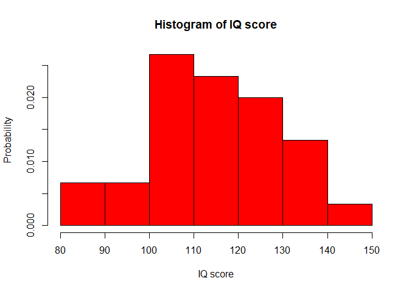
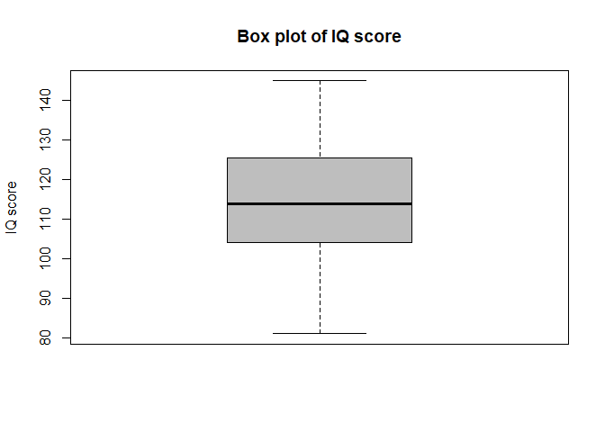
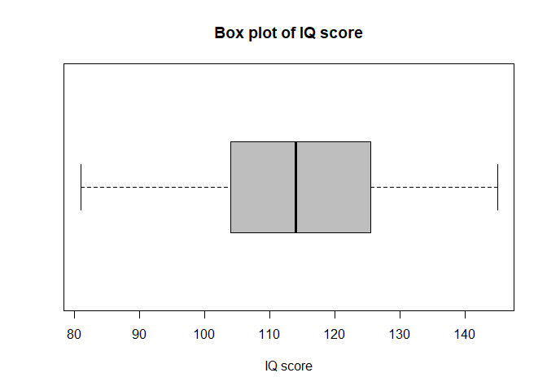
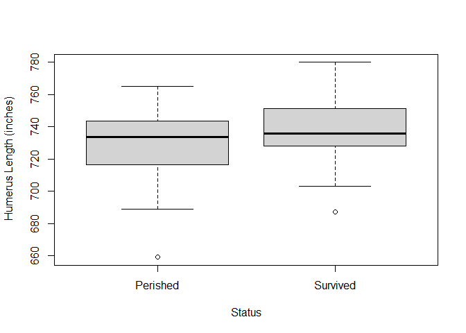
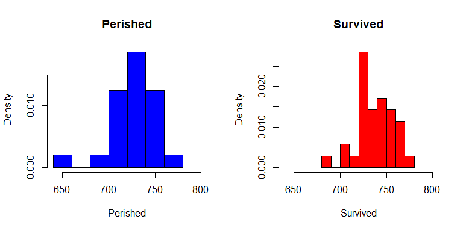
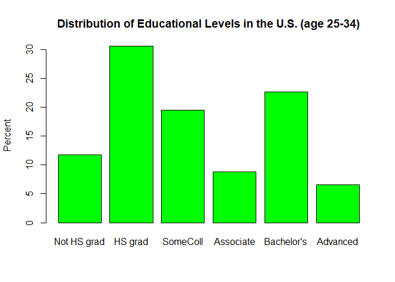
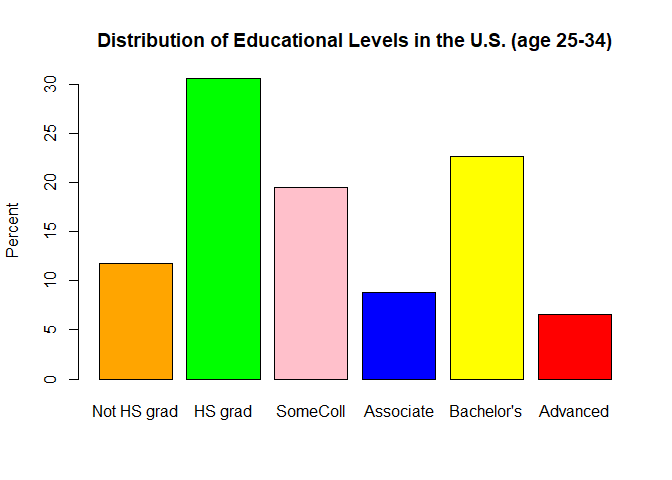
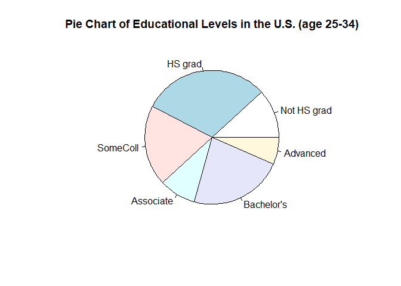
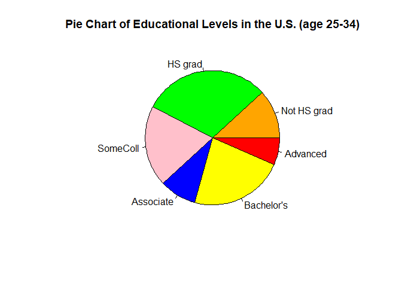

EDA_Lab2 Notebook
================

This is an [R Markdown](http://rmarkdown.rstudio.com) Notebook. When you
execute code within the notebook, the results appear beneath the code.

Try executing this chunk by clicking the Run button within the chunk or
by placing your cursor inside it and pressing Ctrl+Shift+Enter.

# Import data

``` r
## import the data in to R. Make sure to save the data in the same directory as your R code/workspace. 
IQdata=read.csv("EDA_iq.csv")
head(IQdata)
```

    ##   id IQ_score
    ## 1  1      145
    ## 2  2      139
    ## 3  3      126
    ## 4  4      122
    ## 5  5      125
    ## 6  6      130

``` r
tail(IQdata)
```

    ##    id IQ_score
    ## 55 55      114
    ## 56 56      112
    ## 57 57      114
    ## 58 58      102
    ## 59 59       82
    ## 60 60      101

# Stem Plot

``` r
## stemplot if the IQ score (use IQdata$IQ_score to call IQ_score column)
stem(IQdata$IQ_score,scale=1) # scale =1
```

    ## 
    ##   The decimal point is 1 digit(s) to the right of the |
    ## 
    ##    8 | 129
    ##    9 | 0467
    ##   10 | 01112223568999
    ##   11 | 00022334445677788
    ##   12 | 22344456778
    ##   13 | 013446799
    ##   14 | 25

``` r
## stemplot of the IQ score (use IQdata$IQ_score to call IQ_score column)
stem(IQdata$IQ_score,scale=2) # scale =2
```

    ## 
    ##   The decimal point is 1 digit(s) to the right of the |
    ## 
    ##    8 | 12
    ##    8 | 9
    ##    9 | 04
    ##    9 | 67
    ##   10 | 01112223
    ##   10 | 568999
    ##   11 | 0002233444
    ##   11 | 5677788
    ##   12 | 223444
    ##   12 | 56778
    ##   13 | 01344
    ##   13 | 6799
    ##   14 | 2
    ##   14 | 5

# Histogram

``` r
## histogram plot (use IQdata$IQ_score to call IQ_score column)
hist(IQdata$IQ_score, main="Histogram of IQ score", xlab="IQ score", ylab="Count",col="red", prob=F)
```

<!-- -->

``` r
## histogram plot (use IQdata$IQ_score to call IQ_score column)
hist(IQdata$IQ_score, main="Histogram of IQ score", xlab="IQ score", ylab="Probability",col="red", prob=T)
```

<!-- -->

# Box plot

``` r
## vertical box plot
boxplot(IQdata$IQ_score, col="grey", ylab="IQ score", main="Box plot of IQ score")
```

<!-- -->

``` r
## horizontal box plot
boxplot(IQdata$IQ_score, col="grey", xlab="IQ score", main="Box plot of IQ score", horizontal=T)
```

<!-- -->

# Five-number summary

``` r
## 5 number summary 
five_number=quantile(IQdata$IQ_score, c(0, 0.25, 0.5,0.75, 1))

five_number
```

    ##     0%    25%    50%    75%   100% 
    ##  81.00 104.50 114.00 125.25 145.00

# Mean, median, and standard deviation

``` r
mu_iq=mean(IQdata$IQ_score)
sigma_iq=sd(IQdata$IQ_score)
var_iq=var(IQdata$IQ_score)
median_iq=median(IQdata$IQ_score)
```

``` r
# output important numerical summary
summary(IQdata$IQ_score)
```

    ##    Min. 1st Qu.  Median    Mean 3rd Qu.    Max. 
    ##    81.0   104.5   114.0   115.0   125.2   145.0

# Side by side plots

``` r
library(Sleuth2)
```

    ## Warning: package 'Sleuth2' was built under R version 4.3.3

``` r
Bumpus=case0201
summary(Bumpus)
```

    ##     Humerus           Status  
    ##  Min.   :659.0   Perished:24  
    ##  1st Qu.:724.5   Survived:35  
    ##  Median :736.0                
    ##  Mean   :733.9                
    ##  3rd Qu.:747.0                
    ##  Max.   :780.0

``` r
## side by side box plot
boxplot(Bumpus$Humerus~Bumpus$Status, xlab= 'Status', ylab = ' Humerus Length (inches)') ## side by side box plot HERE
```

<!-- -->

``` r
## unpack the data by status
Perished=Bumpus$Humerus[Bumpus$Status=="Perished"] 

Survived=Bumpus$Humerus[Bumpus$Status=="Survived"] 

## draw side by side histogram
par(mfrow=c(1,2))# subplots of 2 rows by 1 column

#one hist atop the other one
hist(Perished,main="Perished",col='blue',xlim = c(640,800),prob=T) ## draw histogram HERE
hist(Survived,main="Survived",col='red',xlim = c(640,800),prob=T) ## draw histogram  HERE
```

<!-- -->

``` r
summary(Perished)
```

    ##    Min. 1st Qu.  Median    Mean 3rd Qu.    Max. 
    ##   659.0   718.2   733.5   727.9   743.2   765.0

``` r
summary(Survived)
```

    ##    Min. 1st Qu.  Median    Mean 3rd Qu.    Max. 
    ##   687.0   728.0   736.0   738.0   751.5   780.0

# Categorical data

``` r
Education_count=c(4.6, 11.6, 7.4, 3.3, 8.6, 2.5) #count in millions
Education_percent=c(11.8, 30.6, 19.5, 8.8, 22.7, 6.6) 


names(Education_percent)=c("Not HS grad", "HS grad", "SomeColl", "Associate", "Bachelor's", "Advanced")#self-explanatory
Education_percent
```

    ## Not HS grad     HS grad    SomeColl   Associate  Bachelor's    Advanced 
    ##        11.8        30.6        19.5         8.8        22.7         6.6

``` r
names(Education_count)=c("Not HS grad", "HS grad", "SomeColl", "Associate", "Bachelor's", "Advanced")#self-explanatory
Education_count
```

    ## Not HS grad     HS grad    SomeColl   Associate  Bachelor's    Advanced 
    ##         4.6        11.6         7.4         3.3         8.6         2.5

# Bar plot

``` r
barplot(Education_percent,col='green', ylab="Percent", main="Distribution of Educational Levels in the U.S. (age 25-34)")
```

<!-- -->

``` r
barplot(Education_percent,col= c("orange", "green", "pink", "blue", "yellow", "red"), ylab="Percent", main="Distribution of Educational Levels in the U.S. (age 25-34)")
```

<!-- -->

# Pie chart

``` r
pie(Education_percent,main="Pie Chart of Educational Levels in the U.S. (age 25-34)")
```

<!-- -->

``` r
pie(Education_percent,col= c("orange", "green", "pink", "blue", "yellow", "red"),main="Pie Chart of Educational Levels in the U.S. (age 25-34)")
```

<!-- -->

Add a new chunk by clicking the Insert Chunk button on the toolbar or by
pressing Ctrl+Alt+I.

When you save the notebook, an HTML file containing the code and output
will be saved alongside it (click the Preview button or press
Ctrl+Shift+K to preview the HTML file).

The preview shows you a rendered HTML copy of the contents of the
editor. Consequently, unlike Knit, Preview does not run any R code
chunks. Instead, the output of the chunk when it was last run in the
editor is displayed.
