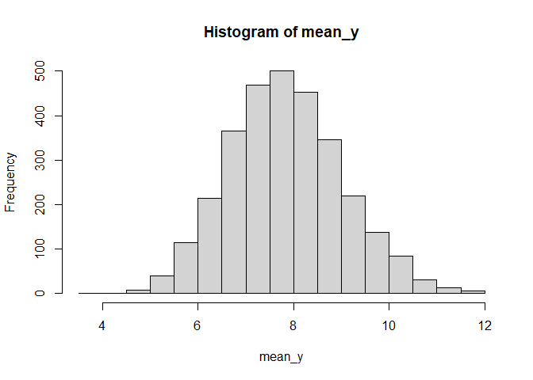
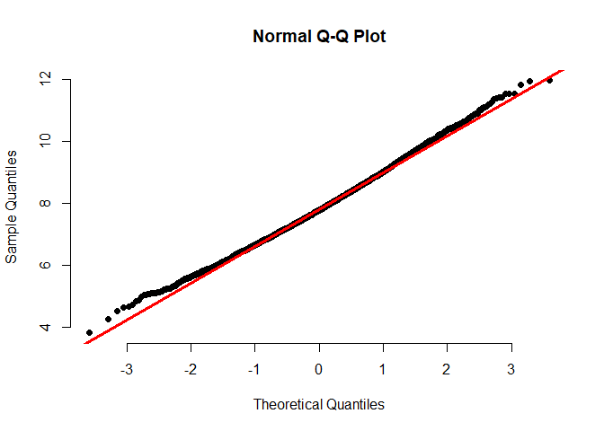
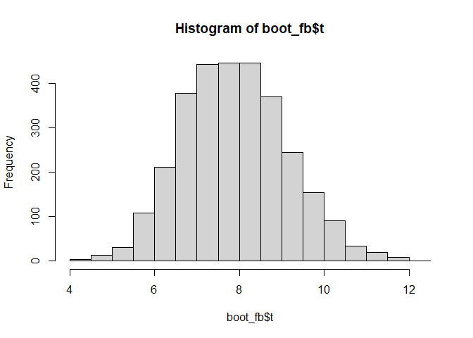
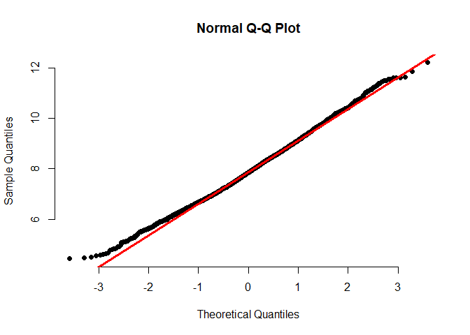
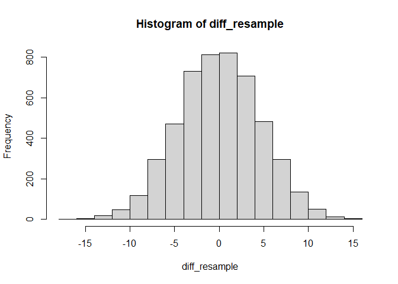

Alternative Tests
================

This is an [R Markdown](http://rmarkdown.rstudio.com) Notebook. When you
execute code within the notebook, the results appear beneath the code.

Try executing this chunk by clicking the *Run* button within the chunk
or by placing your cursor inside it and pressing *Ctrl+Shift+Enter*.

# Wilcoxon Rank Sum

``` r
library(Sleuth2)
```

    ## Warning: package 'Sleuth2' was built under R version 4.3.3

``` r
Bumpus=case0201
summary(Bumpus)
```

    ##     Humerus           Status  
    ##  Min.   :659.0   Perished:24  
    ##  1st Qu.:724.5   Survived:35  
    ##  Median :736.0                
    ##  Mean   :733.9                
    ##  3rd Qu.:747.0                
    ##  Max.   :780.0

``` r
wilcox.test(Bumpus$Humerus~ Bumpus$Status, conf.int= TRUE)
```

    ## Warning in wilcox.test.default(x = DATA[[1L]], y = DATA[[2L]], ...): cannot
    ## compute exact p-value with ties

    ## Warning in wilcox.test.default(x = DATA[[1L]], y = DATA[[2L]], ...): cannot
    ## compute exact confidence intervals with ties

    ## 
    ##  Wilcoxon rank sum test with continuity correction
    ## 
    ## data:  Bumpus$Humerus by Bumpus$Status
    ## W = 331, p-value = 0.1718
    ## alternative hypothesis: true location shift is not equal to 0
    ## 95 percent confidence interval:
    ##  -19.000020   3.000012
    ## sample estimates:
    ## difference in location 
    ##              -7.000063

``` r
wilcox.test(Bumpus$Humerus~ Bumpus$Status, conf.int= TRUE, exact=F)
```

    ## 
    ##  Wilcoxon rank sum test with continuity correction
    ## 
    ## data:  Bumpus$Humerus by Bumpus$Status
    ## W = 331, p-value = 0.1718
    ## alternative hypothesis: true location shift is not equal to 0
    ## 95 percent confidence interval:
    ##  -19.000020   3.000012
    ## sample estimates:
    ## difference in location 
    ##              -7.000063

# Wilcoxon signed rank

``` r
Darwindata=read.csv("DarwinData.csv")
wilcox.test(Darwindata$CROSS, Darwindata$SELF, paired=T, conf.int=T)
```

    ## 
    ##  Wilcoxon signed rank exact test
    ## 
    ## data:  Darwindata$CROSS and Darwindata$SELF
    ## V = 96, p-value = 0.04126
    ## alternative hypothesis: true location shift is not equal to 0
    ## 95 percent confidence interval:
    ##  0.50 5.19
    ## sample estimates:
    ## (pseudo)median 
    ##          3.125

# Bootstrapping (the long way)

``` r
N=3000
FBdata=read.csv("FacebookData.csv")
mean_y=c()
for (i in 1:N){
  y=sample(FBdata$Time, size=21, replace = TRUE)
  mean_y[i]=mean(y)
}
```

``` r
hist(mean_y)
```

<!-- -->

``` r
qqnorm(mean_y, pch = 19, frame = FALSE)
qqline(mean_y, col = "red", lwd = 3)
```

<!-- -->

# Bootstrapping (the short way)

``` r
meanValues = function(data,indices){
  resampled_data = data[indices]
  mean(resampled_data)
}
```

``` r
library(boot)
set.seed(2018)

boot_fb = boot(FBdata$Time, statistic=meanValues, R=3000)
```

``` r
hist(boot_fb$t)
```

<!-- -->

``` r
qqnorm(boot_fb$t, pch = 19, frame = FALSE)
qqline(boot_fb$t, col = "red", lwd = 3)
```

<!-- -->

``` r
boot.ci(boot_fb,conf=0.95, type="perc")
```

    ## BOOTSTRAP CONFIDENCE INTERVAL CALCULATIONS
    ## Based on 3000 bootstrap replicates
    ## 
    ## CALL : 
    ## boot.ci(boot.out = boot_fb, conf = 0.95, type = "perc")
    ## 
    ## Intervals : 
    ## Level     Percentile     
    ## 95%   ( 5.654, 10.399 )  
    ## Calculations and Intervals on Original Scale

``` r
boot.ci(boot_fb,conf=0.95, type="bca")
```

    ## BOOTSTRAP CONFIDENCE INTERVAL CALCULATIONS
    ## Based on 3000 bootstrap replicates
    ## 
    ## CALL : 
    ## boot.ci(boot.out = boot_fb, conf = 0.95, type = "bca")
    ## 
    ## Intervals : 
    ## Level       BCa          
    ## 95%   ( 5.856, 10.699 )  
    ## Calculations and Intervals on Original Scale

# Permutation Tests

``` r
library(perm)
```

    ## Warning: package 'perm' was built under R version 4.3.3

``` r
set.seed(1)
DRP=read.csv("DRPData.csv")
control=DRP$drp[DRP$group=="Control"]
treatment=DRP$drp[DRP$group=="Treat"]
permTS(treatment, control, alternative="greater",method="exact.mc",
       control=permControl(nmc=5000))
```

    ## 
    ##  Exact Permutation Test Estimated by Monte Carlo
    ## 
    ## data:  treatment and control
    ## p-value = 0.0148
    ## alternative hypothesis: true mean treatment - mean control is greater than 0
    ## sample estimates:
    ## mean treatment - mean control 
    ##                      9.954451 
    ## 
    ## p-value estimated from 5000 Monte Carlo replications
    ## 99 percent confidence interval on p-value:
    ##  0.01059443 0.01955700

# Permutation Tests (the long way)

``` r
set.seed(1)
allData=c(control ,treatment)
n1=length(treatment)
n2=length(control)
diff=mean(treatment)-mean(control)
N=5000
diff_resample=c()

for (i in 1:N) {
  x=sample(allData, n1+n2,replace=F)
  treatment_resample=x[1:n1]
  control_resample=x[n1+1:n2]
  diff_resample[i]=mean(treatment_resample)-mean(control_resample)
}

hist(diff_resample)
```

<!-- -->

``` r
index_bigger=which(diff_resample>=diff)
p=length(index_bigger)/N
p
```

    ## [1] 0.014

Add a new chunk by clicking the *Insert Chunk* button on the toolbar or
by pressing *Ctrl+Alt+I*.

When you save the notebook, an HTML file containing the code and output
will be saved alongside it (click the *Preview* button or press
*Ctrl+Shift+K* to preview the HTML file).

The preview shows you a rendered HTML copy of the contents of the
editor. Consequently, unlike *Knit*, *Preview* does not run any R code
chunks. Instead, the output of the chunk when it was last run in the
editor is displayed.
