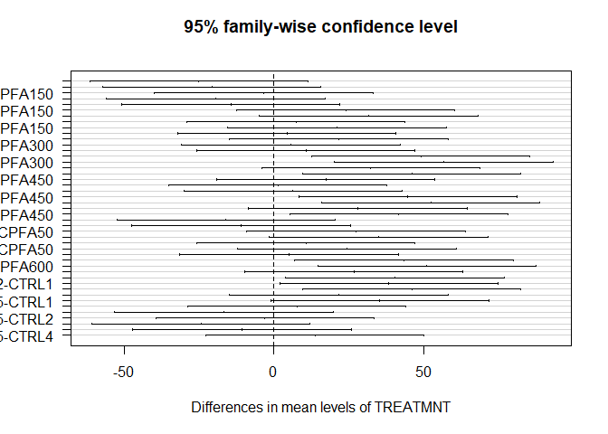
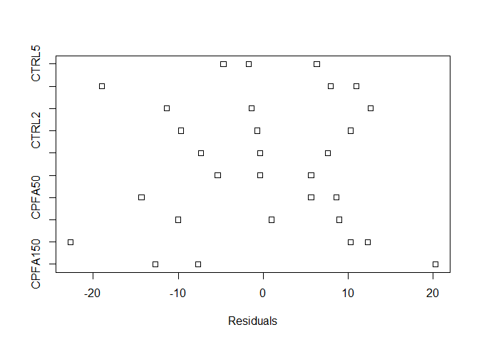
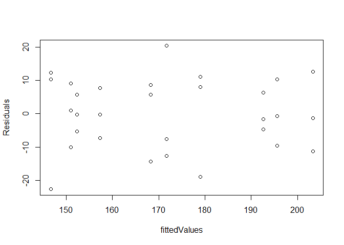
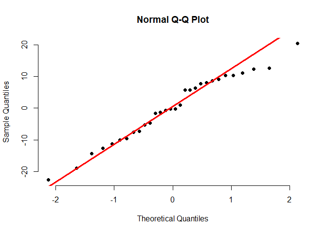
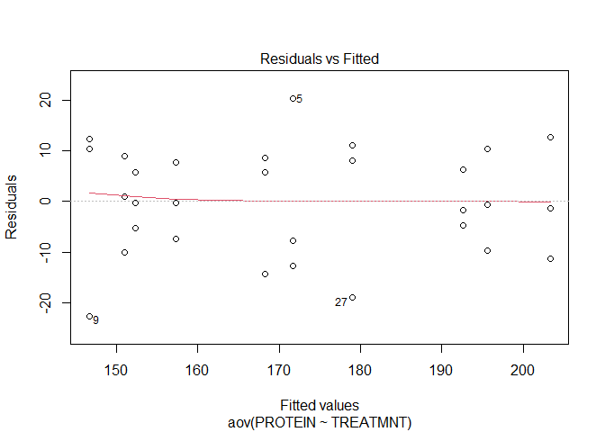
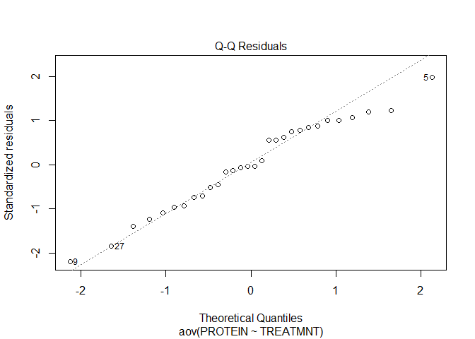
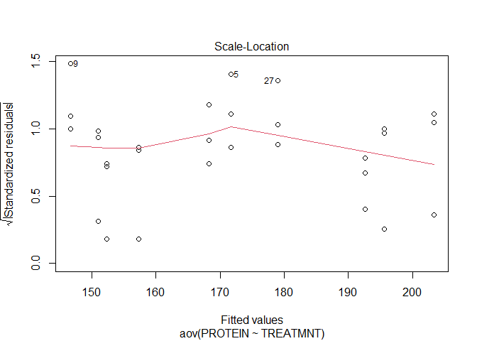
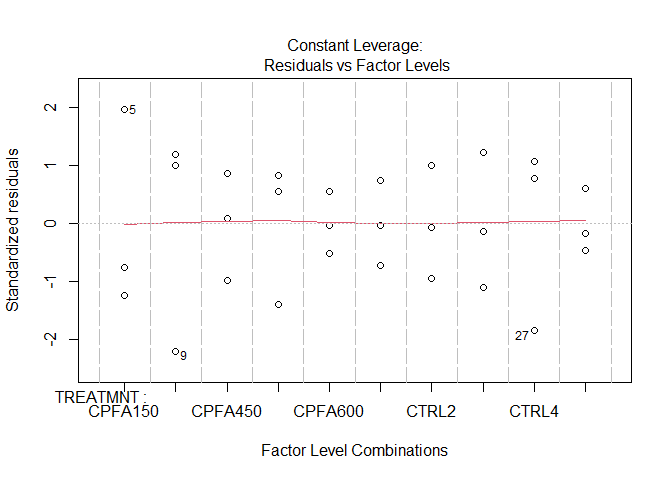

ANOVA
================

This is an [R Markdown](http://rmarkdown.rstudio.com) Notebook. When you
execute code within the notebook, the results appear beneath the code.

Try executing this chunk by clicking the *Run* button within the chunk
or by placing your cursor inside it and pressing *Ctrl+Shift+Enter*.

# Enter data

``` r
FattyAcid=read.csv("FattyAcidData.csv")
```

# ANOVA Full Model

``` r
fullModel=aov(PROTEIN~TREATMNT,data=FattyAcid)
summary(fullModel)
```

    ##             Df Sum Sq Mean Sq F value   Pr(>F)    
    ## TREATMNT     9  11147  1238.6   7.801 7.15e-05 ***
    ## Residuals   20   3175   158.8                     
    ## ---
    ## Signif. codes:  0 '***' 0.001 '**' 0.01 '*' 0.05 '.' 0.1 ' ' 1

``` r
TukeyHSD(fullModel, conf.level=.95)
```

    ##   Tukey multiple comparisons of means
    ##     95% family-wise confidence level
    ## 
    ## Fit: aov(formula = PROTEIN ~ TREATMNT, data = FattyAcid)
    ## 
    ## $TREATMNT
    ##                       diff        lwr      upr     p adj
    ## CPFA300-CPFA150 -25.000000 -61.431175 11.43118 0.3595846
    ## CPFA450-CPFA150 -20.666667 -57.097842 15.76451 0.6030194
    ## CPFA50-CPFA150   -3.333333 -39.764508 33.09784 0.9999987
    ## CPFA600-CPFA150 -19.333333 -55.764508 17.09784 0.6817347
    ## CTRL1-CPFA150   -14.333333 -50.764508 22.09784 0.9156354
    ## CTRL2-CPFA150    24.000000 -12.431175 60.43118 0.4112084
    ## CTRL3-CPFA150    31.666667  -4.764508 68.09784 0.1230752
    ## CTRL4-CPFA150     7.333333 -29.097842 43.76451 0.9990703
    ## CTRL5-CPFA150    21.000000 -15.431175 57.43118 0.5831501
    ## CPFA450-CPFA300   4.333333 -32.097842 40.76451 0.9999878
    ## CPFA50-CPFA300   21.666667 -14.764508 58.09784 0.5435552
    ## CPFA600-CPFA300   5.666667 -30.764508 42.09784 0.9998830
    ## CTRL1-CPFA300    10.666667 -25.764508 47.09784 0.9857664
    ## CTRL2-CPFA300    49.000000  12.568825 85.43118 0.0036728
    ## CTRL3-CPFA300    56.666667  20.235492 93.09784 0.0007204
    ## CTRL4-CPFA300    32.333333  -4.097842 68.76451 0.1090741
    ## CTRL5-CPFA300    46.000000   9.568825 82.43118 0.0069490
    ## CPFA50-CPFA450   17.333333 -19.097842 53.76451 0.7913483
    ## CPFA600-CPFA450   1.333333 -35.097842 37.76451 1.0000000
    ## CTRL1-CPFA450     6.333333 -30.097842 42.76451 0.9997097
    ## CTRL2-CPFA450    44.666667   8.235492 81.09784 0.0092126
    ## CTRL3-CPFA450    52.333333  15.902158 88.76451 0.0018058
    ## CTRL4-CPFA450    28.000000  -8.431175 64.43118 0.2297238
    ## CTRL5-CPFA450    41.666667   5.235492 78.09784 0.0172732
    ## CPFA600-CPFA50  -16.000000 -52.431175 20.43118 0.8538248
    ## CTRL1-CPFA50    -11.000000 -47.431175 25.43118 0.9825562
    ## CTRL2-CPFA50     27.333333  -9.097842 63.76451 0.2551609
    ## CTRL3-CPFA50     35.000000  -1.431175 71.43118 0.0660885
    ## CTRL4-CPFA50     10.666667 -25.764508 47.09784 0.9857664
    ## CTRL5-CPFA50     24.333333 -12.097842 60.76451 0.3935869
    ## CTRL1-CPFA600     5.000000 -31.431175 41.43118 0.9999588
    ## CTRL2-CPFA600    43.333333   6.902158 79.76451 0.0121963
    ## CTRL3-CPFA600    51.000000  14.568825 87.43118 0.0023986
    ## CTRL4-CPFA600    26.666667  -9.764508 63.09784 0.2825716
    ## CTRL5-CPFA600    40.333333   3.902158 76.76451 0.0227564
    ## CTRL2-CTRL1      38.333333   1.902158 74.76451 0.0342103
    ## CTRL3-CTRL1      46.000000   9.568825 82.43118 0.0069490
    ## CTRL4-CTRL1      21.666667 -14.764508 58.09784 0.5435552
    ## CTRL5-CTRL1      35.333333  -1.097842 71.76451 0.0619658
    ## CTRL3-CTRL2       7.666667 -28.764508 44.09784 0.9986886
    ## CTRL4-CTRL2     -16.666667 -53.097842 19.76451 0.8238937
    ## CTRL5-CTRL2      -3.000000 -39.431175 33.43118 0.9999995
    ## CTRL4-CTRL3     -24.333333 -60.764508 12.09784 0.3935869
    ## CTRL5-CTRL3     -10.666667 -47.097842 25.76451 0.9857664
    ## CTRL5-CTRL4      13.666667 -22.764508 50.09784 0.9348535

``` r
plot(TukeyHSD(fullModel, conf.level=.95), las=1)
```

<!-- -->

``` r
Residuals=resid(lm(PROTEIN~TREATMNT,data=FattyAcid))#function resid computes the residuals
stripchart(Residuals~FattyAcid$TREATMNT)#plots residuals vs. Treatments
```

<!-- -->

``` r
fittedValues= fitted(lm(PROTEIN~TREATMNT,data=FattyAcid))# the fitted values are the sample means
plot(fittedValues,Residuals)#gives the standard residual plot
```

<!-- -->

``` r
qqnorm(Residuals, pch = 19, frame = FALSE)
qqline(Residuals, col = "red", lwd = 3)
```

<!-- -->

``` r
plot(fullModel)
```

<!-- --><!-- --><!-- --><!-- -->

# Reduced model

``` r
FattyAcidReduced=read.csv("FattyAcidData_reduced.csv")
reduceModel=aov(PROTEIN~TREATMNT,data=FattyAcidReduced)
summary(reduceModel)
```

    ##             Df Sum Sq Mean Sq F value Pr(>F)   
    ## TREATMNT     5   7223  1444.5   4.883 0.0032 **
    ## Residuals   24   7100   295.8                  
    ## ---
    ## Signif. codes:  0 '***' 0.001 '**' 0.01 '*' 0.05 '.' 0.1 ' ' 1

``` r
anova(reduceModel,fullModel)
```

    ## Analysis of Variance Table
    ## 
    ## Model 1: PROTEIN ~ TREATMNT
    ## Model 2: PROTEIN ~ TREATMNT
    ##   Res.Df    RSS Df Sum of Sq      F   Pr(>F)   
    ## 1     24 7100.3                                
    ## 2     20 3175.3  4    3924.9 6.1803 0.002089 **
    ## ---
    ## Signif. codes:  0 '***' 0.001 '**' 0.01 '*' 0.05 '.' 0.1 ' ' 1

# Kruskal-Wallis Test

``` r
KWModel=kruskal.test(PROTEIN~TREATMNT,data=FattyAcid)
KWModel
```

    ## 
    ##  Kruskal-Wallis rank sum test
    ## 
    ## data:  PROTEIN by TREATMNT
    ## Kruskal-Wallis chi-squared = 22.315, df = 9, p-value = 0.007932

Add a new chunk by clicking the *Insert Chunk* button on the toolbar or
by pressing *Ctrl+Alt+I*.

When you save the notebook, an HTML file containing the code and output
will be saved alongside it (click the *Preview* button or press
*Ctrl+Shift+K* to preview the HTML file).

The preview shows you a rendered HTML copy of the contents of the
editor. Consequently, unlike *Knit*, *Preview* does not run any R code
chunks. Instead, the output of the chunk when it was last run in the
editor is displayed.
