Simple Linear Regression
================

This is an [R Markdown](http://rmarkdown.rstudio.com) Notebook. When you
execute code within the notebook, the results appear beneath the code.

Try executing this chunk by clicking the *Run* button within the chunk
or by placing your cursor inside it and pressing *Ctrl+Shift+Enter*.

``` r
HealthData=read.csv("HealthData.csv")
```

# EDA

``` r
par(mfrow=c(1,2))# subplots of 2 rows by 1 column
hist(HealthData$Life.expectancy.all.races.2017)
hist(HealthData$CurrentSmoker.)
```

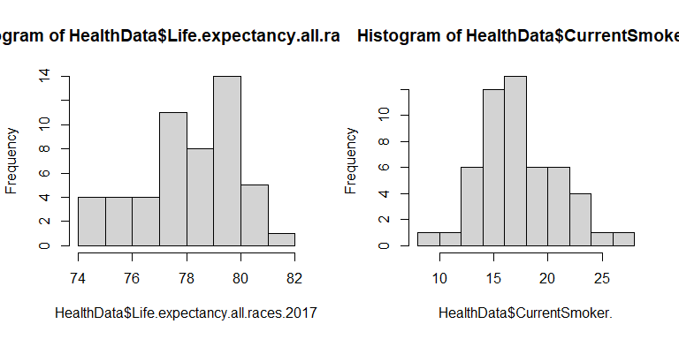<!-- -->

``` r
par(mfrow=c(1,2))# subplots of 2 rows by 1 column

qqnorm(HealthData$Life.expectancy.all.races.2017, pch = 19, frame = FALSE)
qqline(HealthData$Life.expectancy.all.races.2017, col = "red", lwd = 3)

qqnorm(HealthData$CurrentSmoker., pch = 19, frame = FALSE)
qqline(HealthData$CurrentSmoker., col = "red", lwd = 3)
```

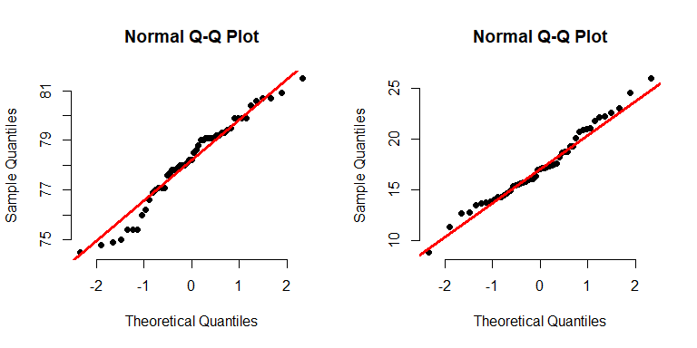<!-- -->

# Regression Model

``` r
lm_model = lm(Life.expectancy.all.races.2017~CurrentSmoker.,HealthData)
summary(lm_model)
```

    ## 
    ## Call:
    ## lm(formula = Life.expectancy.all.races.2017 ~ CurrentSmoker., 
    ##     data = HealthData)
    ## 
    ## Residuals:
    ##     Min      1Q  Median      3Q     Max 
    ## -2.5231 -0.3739  0.1441  0.5178  1.3732 
    ## 
    ## Coefficients:
    ##                Estimate Std. Error t value Pr(>|t|)    
    ## (Intercept)    85.67563    0.64837  132.14  < 2e-16 ***
    ## CurrentSmoker. -0.43384    0.03681  -11.79 6.54e-16 ***
    ## ---
    ## Signif. codes:  0 '***' 0.001 '**' 0.01 '*' 0.05 '.' 0.1 ' ' 1
    ## 
    ## Residual standard error: 0.9074 on 49 degrees of freedom
    ## Multiple R-squared:  0.7392, Adjusted R-squared:  0.7339 
    ## F-statistic: 138.9 on 1 and 49 DF,  p-value: 6.542e-16

``` r
plot(HealthData$CurrentSmoker., HealthData$Life.expectancy.all.races.2017, col= "red", main= "Life Exp against smoking rate", xlab= "Smoking", ylab= "Life Exp", pch=19) 
abline(lm_model, col= "black" , lwd= 3) 
```

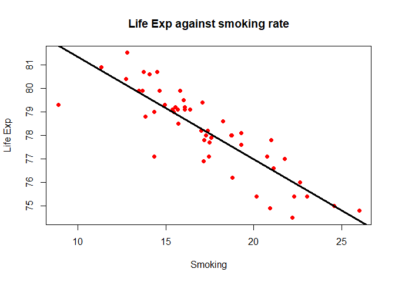<!-- -->

``` r
yFitted=fitted(lm_model)
yRes= resid(lm_model)
HealthData_LinearRegression=data.frame(HealthData, yFitted, yRes)
write.csv(HealthData_LinearRegression, "HealthData_LinearRegression.csv", row.names=TRUE)
```

``` r
#find Square Error (SSE) (unexplained variation)
sse = sum((yFitted- HealthData$Life.expectancy.all.races.2017)^2)


#find SS Regression (SSR) (variation explained by regression line)
ssr = sum((yFitted - mean(HealthData$Life.expectancy.all.races.2017))^2)


#find SST (total sum of squares)
sst = ssr + sse

# r^2
r_square=ssr/sst

# correlation
r_fromModel=sqrt(r_square)

# Residual standard error
n=length(HealthData$Life.expectancy.all.races.2017)
Residue_SE=sqrt(sse/(n-2))
```

# Prediction and mean response interval

``` r
z=data.frame(Intercept=1, CurrentSmoker.=17.08)

predict(lm_model,z, interval="prediction", level=.95)
```

    ##        fit     lwr      upr
    ## 1 78.26563 76.4243 80.10697

``` r
predict(lm_model,z, interval="confidence", level=.95)
```

    ##        fit     lwr      upr
    ## 1 78.26563 78.0099 78.52137

``` r
library(pracma)
```

    ## Warning: package 'pracma' was built under R version 4.3.3

``` r
N=100
zInt=linspace(1, 1, n=N)
zSmoke=linspace(min(HealthData$CurrentSmoker.),max(HealthData$CurrentSmoker.), n=N)
zVec=data.frame(Intercept=zInt, CurrentSmoker.=zSmoke)


yPred=predict(lm_model,zVec, interval="prediction", level=.95)
yMean=predict(lm_model,zVec, interval="confidence", level=.95)
```

``` r
plot(HealthData$CurrentSmoker., HealthData$Life.expectancy.all.races.2017, col= "red", main= "Life Exp against smoking rate", xlab= "Smoking", ylab= "Life Exp", pch=19) 
abline(lm_model, col= "black" , lwd= 3) 

lines(zVec[,2], yPred[,2], col= "blue")  #lower prediction value
lines(zVec[,2], yPred[,3], col= "blue")  #upper prediction value

lines(zVec[,2], yMean[,2], col= "green")  #lower mean response value
lines(zVec[,2], yMean[,3], col= "green")  #uppwer mean response value
```

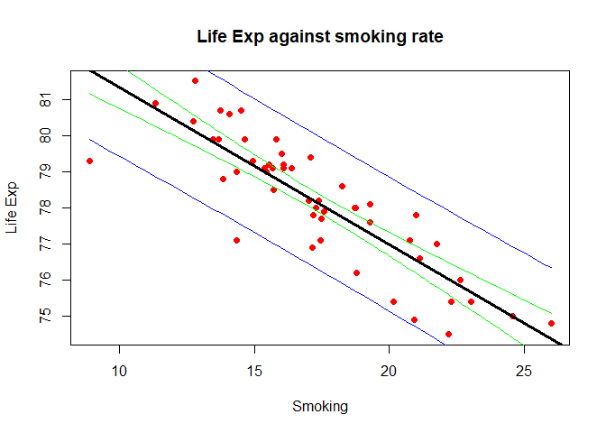<!-- -->

# Diagnostic

``` r
plot(lm_model)
```

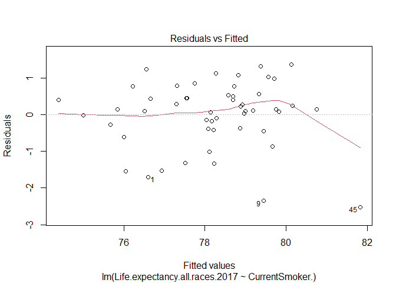<!-- -->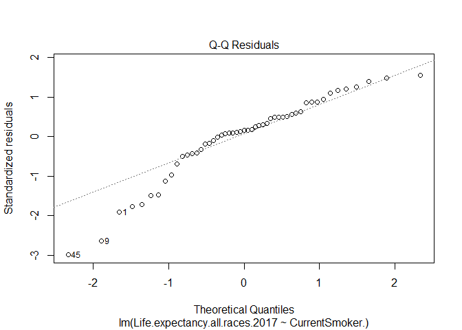<!-- -->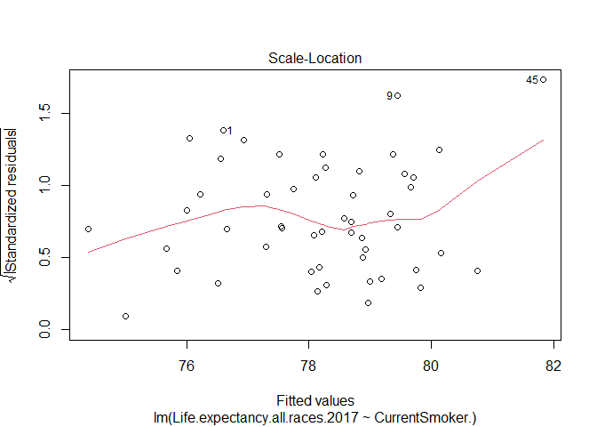<!-- -->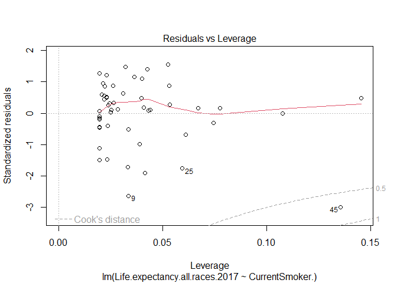<!-- -->

``` r
lm_reduced_Utah = lm(Life.expectancy.all.races.2017 ~CurrentSmoker.,HealthData,subset=(State != "Utah"))
summary(lm_reduced_Utah)
```

    ## 
    ## Call:
    ## lm(formula = Life.expectancy.all.races.2017 ~ CurrentSmoker., 
    ##     data = HealthData, subset = (State != "Utah"))
    ## 
    ## Residuals:
    ##      Min       1Q   Median       3Q      Max 
    ## -2.52503 -0.38372  0.05625  0.50457  1.33281 
    ## 
    ## Coefficients:
    ##                Estimate Std. Error t value Pr(>|t|)    
    ## (Intercept)    86.42906    0.63543  136.02   <2e-16 ***
    ## CurrentSmoker. -0.47415    0.03581  -13.24   <2e-16 ***
    ## ---
    ## Signif. codes:  0 '***' 0.001 '**' 0.01 '*' 0.05 '.' 0.1 ' ' 1
    ## 
    ## Residual standard error: 0.8289 on 48 degrees of freedom
    ## Multiple R-squared:  0.7851, Adjusted R-squared:  0.7806 
    ## F-statistic: 175.3 on 1 and 48 DF,  p-value: < 2.2e-16

``` r
plot(HealthData$CurrentSmoker., HealthData$Life.expectancy.all.races.2017, col= "red", main= "Life Exp against smoking rate", xlab= "Smoking", ylab= "Life Exp", pch=19) 
abline(lm_model, col= "black" , lwd= 3) 
abline(lm_reduced_Utah, col= "green" , lwd= 3) 
```

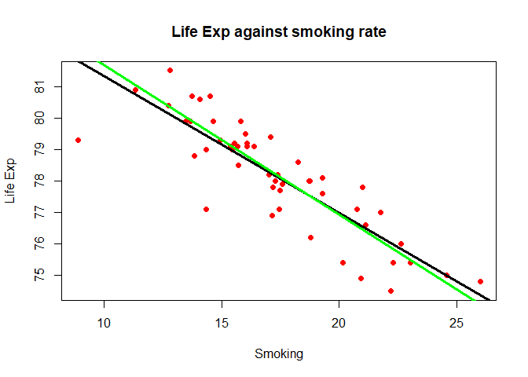<!-- -->

``` r
plot(dfbeta(lm_model)[,2],ylab="Change in the slope")
abline(h=0)
```

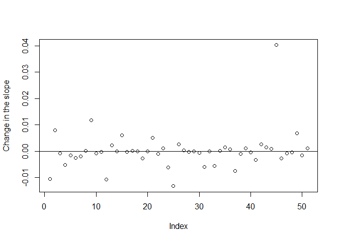<!-- -->

``` r
plot(dfbeta(lm_model)[,1],ylab="Change in the intercept")
abline(h=0)
```

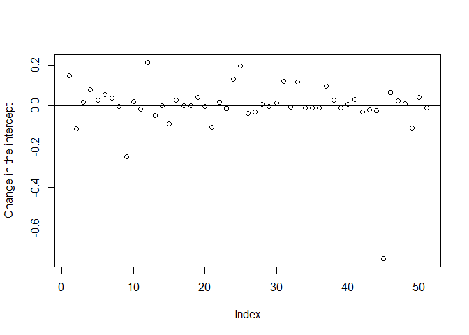<!-- -->

``` r
plot(HealthData$CurrentSmoker.,residuals(lm_model), xlab="Smoking Rate",ylab
="Residuals")
abline(h=0)
```

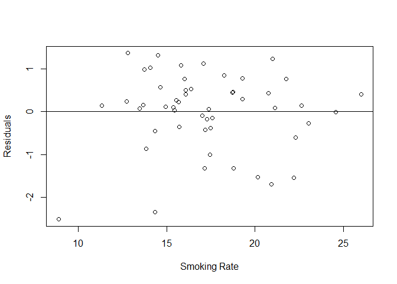<!-- -->

``` r
hatv = hatvalues(lm_model)
rvalue= rstandard(lm_model)
stud = rstudent(lm_model)
cook = cooks.distance(lm_model)
```

Add a new chunk by clicking the *Insert Chunk* button on the toolbar or
by pressing *Ctrl+Alt+I*.

When you save the notebook, an HTML file containing the code and output
will be saved alongside it (click the *Preview* button or press
*Ctrl+Shift+K* to preview the HTML file).

The preview shows you a rendered HTML copy of the contents of the
editor. Consequently, unlike *Knit*, *Preview* does not run any R code
chunks. Instead, the output of the chunk when it was last run in the
editor is displayed.
