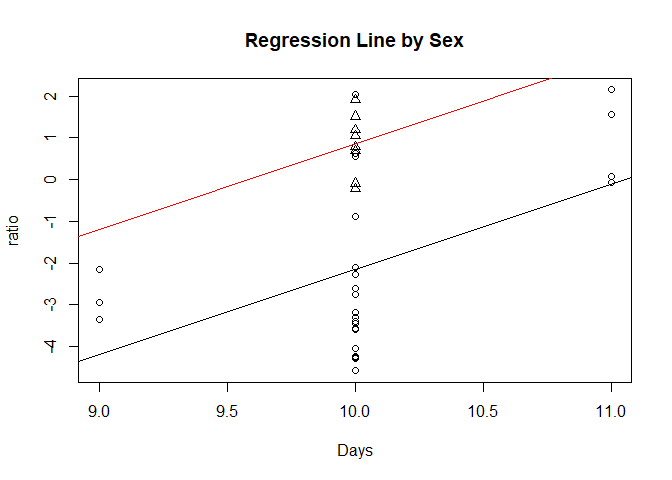
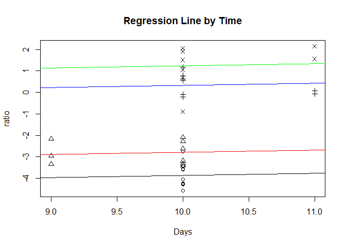

Multiple Regression 3
================

This is an [R Markdown](http://rmarkdown.rstudio.com) Notebook. When you
execute code within the notebook, the results appear beneath the code.

Try executing this chunk by clicking the *Run* button within the chunk
or by placing your cursor inside it and pressing *Ctrl+Shift+Enter*.

``` r
library(Sleuth2)
```

    ## Warning: package 'Sleuth2' was built under R version 4.3.3

``` r
library(corrplot)
```

    ## Warning: package 'corrplot' was built under R version 4.3.3

    ## corrplot 0.95 loaded

``` r
library(car)
```

    ## Warning: package 'car' was built under R version 4.3.3

    ## Loading required package: carData

    ## Warning: package 'carData' was built under R version 4.3.3

``` r
library(olsrr)
```

    ## Warning: package 'olsrr' was built under R version 4.3.3

    ## 
    ## Attaching package: 'olsrr'

    ## The following object is masked from 'package:datasets':
    ## 
    ##     rivers

``` r
tumorData=case1102
summary(tumorData)
```

    ##      Brain            Liver              Time        Treat        Days      
    ##  Min.   :  1334   Min.   :    928   Min.   : 0.500   BD:17   Min.   : 9.00  
    ##  1st Qu.: 19281   1st Qu.:  16210   1st Qu.: 1.125   NS:17   1st Qu.:10.00  
    ##  Median : 32573   Median : 643965   Median : 3.000           Median :10.00  
    ##  Mean   : 39965   Mean   : 668776   Mean   :23.515           Mean   :10.03  
    ##  3rd Qu.: 50654   3rd Qu.:1318557   3rd Qu.:24.000           3rd Qu.:10.00  
    ##  Max.   :123730   Max.   :1790863   Max.   :72.000           Max.   :11.00  
    ##  Sex        Weight           Loss            Tumor      
    ##  F:26   Min.   :184.0   Min.   :-4.900   Min.   : 25.0  
    ##  M: 8   1st Qu.:225.2   1st Qu.: 1.200   1st Qu.:136.2  
    ##         Median :239.5   Median : 3.950   Median :166.0  
    ##         Mean   :241.6   Mean   : 3.638   Mean   :182.9  
    ##         3rd Qu.:259.0   3rd Qu.: 5.975   3rd Qu.:223.2  
    ##         Max.   :298.0   Max.   :12.800   Max.   :484.0

``` r
ratio=log(tumorData$Brain/tumorData$Liver)
a=factor(tumorData$Time) # turn this into factor with three levels
class(a)
```

    ## [1] "factor"

``` r
allData=data.frame(ratio,Time=a,Treat=tumorData$Treat,Days=tumorData$Days, Sex=tumorData$Sex, Weight=tumorData$Weight, Loss=tumorData$Loss, Tumor=tumorData$Tumor)
```

# Multiple Linear Regression with Categorical Variable

``` r
Model_Sex=lm(ratio~Days+Sex, data=allData)
summary(Model_Sex)
```

    ## 
    ## Call:
    ## lm(formula = ratio ~ Days + Sex, data = allData)
    ## 
    ## Residuals:
    ##     Min      1Q  Median      3Q     Max 
    ## -2.4222 -1.2249 -0.0972  1.0080  4.2010 
    ## 
    ## Coefficients:
    ##             Estimate Std. Error t value Pr(>|t|)    
    ## (Intercept) -22.5903     6.3201  -3.574  0.00117 ** 
    ## Days          2.0434     0.6288   3.250  0.00278 ** 
    ## SexM          3.0059     0.6712   4.479 9.51e-05 ***
    ## ---
    ## Signif. codes:  0 '***' 0.001 '**' 0.01 '*' 0.05 '.' 0.1 ' ' 1
    ## 
    ## Residual standard error: 1.659 on 31 degrees of freedom
    ## Multiple R-squared:  0.4885, Adjusted R-squared:  0.4555 
    ## F-statistic:  14.8 on 2 and 31 DF,  p-value: 3.067e-05

``` r
Anova(Model_Sex)
```

    ## Anova Table (Type II tests)
    ## 
    ## Response: ratio
    ##           Sum Sq Df F value    Pr(>F)    
    ## Days      29.069  1  10.562  0.002778 ** 
    ## Sex       55.202  1  20.058 9.512e-05 ***
    ## Residuals 85.316 31                      
    ## ---
    ## Signif. codes:  0 '***' 0.001 '**' 0.01 '*' 0.05 '.' 0.1 ' ' 1

- The equation of the model is $y=-22.59+2.04x_1+3.01x_3$. Here $y$ is
  the log of the ratio of brain tumor concentration and liver tumor
  concentration, $x_1$ is the number of days post inoculation, and $x_3$
  is the sex (0 as F and 1 as M).

- Interpretation: a unit increase in the number of days post inoculation
  ($x_1$) with the other predictor (sex) held constant will produce an
  increase of 2.03 in the log ratio of brain tumor concentration and
  liver tumor concentration. The effect is significant with p-value as
  0.003.

- Interpretation: Given other predictor (number of days post
  inoculation) held constant, a male rat will have an increase of 3.01
  in the log ratio of brain tumor concentration and liver tumor
  concentration as compared to a female rat. The effect is significant
  with p-value as $9.51 \times 10^{-5}$.

- The F test shown here is to take if any of the predictors are useful
  in predicting the response.

  - $H_0$: $\beta_1=\beta_3=0$. This is equivalent to the null model
    ($y=\beta_0$).
  - F statistics is 14.8 with DF as 2 (p-1) and 31 (n-p)
  - p value is $3.07 \times 10^{-5}$
  - Thus, we reject the null hypothesis and conclude that some of the
    predictors are useful.

``` r
contrasts(tumorData$Sex)
```

    ##   M
    ## F 0
    ## M 1

``` r
plot(allData$Days, allData$ratio, pch=as.numeric(allData$Sex), xlab='Days', ylab='ratio',main='Regression Line by Sex')
abline(Model_Sex$coefficients[1], Model_Sex$coefficients[2])# female
abline(Model_Sex$coefficients[1]+ Model_Sex$coefficients[3], Model_Sex$coefficients[2],col='red')#male
```

<!-- -->

``` r
model.matrix(Model_Sex)
```

    ##    (Intercept) Days SexM
    ## 1            1   10    0
    ## 2            1   10    0
    ## 3            1   10    0
    ## 4            1   10    0
    ## 5            1   10    0
    ## 6            1   10    0
    ## 7            1   10    0
    ## 8            1   10    0
    ## 9            1   10    0
    ## 10           1   10    0
    ## 11           1   10    0
    ## 12           1   10    0
    ## 13           1    9    0
    ## 14           1    9    0
    ## 15           1   10    0
    ## 16           1   10    0
    ## 17           1    9    0
    ## 18           1   10    0
    ## 19           1   10    0
    ## 20           1   10    1
    ## 21           1   10    1
    ## 22           1   11    0
    ## 23           1   10    0
    ## 24           1   10    1
    ## 25           1   10    1
    ## 26           1   11    0
    ## 27           1   11    0
    ## 28           1   10    0
    ## 29           1   10    1
    ## 30           1   10    1
    ## 31           1   10    1
    ## 32           1   11    0
    ## 33           1   10    1
    ## 34           1   10    0
    ## attr(,"assign")
    ## [1] 0 1 2
    ## attr(,"contrasts")
    ## attr(,"contrasts")$Sex
    ## [1] "contr.treatment"

``` r
Model_Treat_Sex=lm(ratio~Days+Sex+Sex:Treat, data=allData)
summary(Model_Treat_Sex)
```

    ## 
    ## Call:
    ## lm(formula = ratio ~ Days + Sex + Sex:Treat, data = allData)
    ## 
    ## Residuals:
    ##     Min      1Q  Median      3Q     Max 
    ## -2.3873 -0.9294 -0.3034  1.2844  3.8846 
    ## 
    ## Coefficients:
    ##              Estimate Std. Error t value Pr(>|t|)   
    ## (Intercept)  -21.8221     6.4621  -3.377  0.00210 **
    ## Days           1.9982     0.6396   3.124  0.00402 **
    ## SexM           2.9687     0.9635   3.081  0.00449 **
    ## SexF:TreatNS  -0.6292     0.6619  -0.951  0.34969   
    ## SexM:TreatNS  -0.5584     1.1900  -0.469  0.64238   
    ## ---
    ## Signif. codes:  0 '***' 0.001 '**' 0.01 '*' 0.05 '.' 0.1 ' ' 1
    ## 
    ## Residual standard error: 1.683 on 29 degrees of freedom
    ## Multiple R-squared:  0.5076, Adjusted R-squared:  0.4397 
    ## F-statistic: 7.474 on 4 and 29 DF,  p-value: 0.0002889

``` r
Anova(Model_Treat_Sex)
```

    ## Anova Table (Type II tests)
    ## 
    ## Response: ratio
    ##           Sum Sq Df F value    Pr(>F)    
    ## Days      27.644  1  9.7605 0.0040243 ** 
    ## Sex       55.202  1 19.4910 0.0001284 ***
    ## Sex:Treat  3.183  2  0.5619 0.5762225    
    ## Residuals 82.133 29                      
    ## ---
    ## Signif. codes:  0 '***' 0.001 '**' 0.01 '*' 0.05 '.' 0.1 ' ' 1

``` r
contrasts(tumorData$Treat)
```

    ##    NS
    ## BD  0
    ## NS  1

``` r
model.matrix(Model_Treat_Sex)
```

    ##    (Intercept) Days SexM SexF:TreatNS SexM:TreatNS
    ## 1            1   10    0            0            0
    ## 2            1   10    0            0            0
    ## 3            1   10    0            0            0
    ## 4            1   10    0            0            0
    ## 5            1   10    0            0            0
    ## 6            1   10    0            1            0
    ## 7            1   10    0            1            0
    ## 8            1   10    0            1            0
    ## 9            1   10    0            1            0
    ## 10           1   10    0            0            0
    ## 11           1   10    0            0            0
    ## 12           1   10    0            0            0
    ## 13           1    9    0            0            0
    ## 14           1    9    0            1            0
    ## 15           1   10    0            1            0
    ## 16           1   10    0            1            0
    ## 17           1    9    0            1            0
    ## 18           1   10    0            1            0
    ## 19           1   10    0            0            0
    ## 20           1   10    1            0            0
    ## 21           1   10    1            0            0
    ## 22           1   11    0            0            0
    ## 23           1   10    0            1            0
    ## 24           1   10    1            0            1
    ## 25           1   10    1            0            1
    ## 26           1   11    0            1            0
    ## 27           1   11    0            0            0
    ## 28           1   10    0            0            0
    ## 29           1   10    1            0            0
    ## 30           1   10    1            0            0
    ## 31           1   10    1            0            1
    ## 32           1   11    0            1            0
    ## 33           1   10    1            0            1
    ## 34           1   10    0            1            0
    ## attr(,"assign")
    ## [1] 0 1 2 3 3
    ## attr(,"contrasts")
    ## attr(,"contrasts")$Sex
    ## [1] "contr.treatment"
    ## 
    ## attr(,"contrasts")$Treat
    ## [1] "contr.treatment"

``` r
# 3 level factor 

Model_Time=lm(ratio~Time+Days, data=allData)
summary(Model_Time)
```

    ## 
    ## Call:
    ## lm(formula = ratio ~ Time + Days, data = allData)
    ## 
    ## Residuals:
    ##      Min       1Q   Median       3Q      Max 
    ## -2.11366 -0.41513  0.05248  0.43862  1.11406 
    ## 
    ## Coefficients:
    ##             Estimate Std. Error t value Pr(>|t|)    
    ## (Intercept) -4.85633    3.06475  -1.585  0.12391    
    ## Time3        1.07886    0.33788   3.193  0.00338 ** 
    ## Time24       4.18805    0.34075  12.291 5.05e-13 ***
    ## Time72       5.08467    0.34075  14.922 3.84e-15 ***
    ## Days         0.09973    0.30563   0.326  0.74653    
    ## ---
    ## Signif. codes:  0 '***' 0.001 '**' 0.01 '*' 0.05 '.' 0.1 ' ' 1
    ## 
    ## Residual standard error: 0.6834 on 29 degrees of freedom
    ## Multiple R-squared:  0.9188, Adjusted R-squared:  0.9076 
    ## F-statistic: 82.04 on 4 and 29 DF,  p-value: 2.21e-15

``` r
contrasts(allData$Time)
```

    ##     3 24 72
    ## 0.5 0  0  0
    ## 3   1  0  0
    ## 24  0  1  0
    ## 72  0  0  1

``` r
model.matrix(Model_Time)
```

    ##    (Intercept) Time3 Time24 Time72 Days
    ## 1            1     0      0      0   10
    ## 2            1     0      0      0   10
    ## 3            1     0      0      0   10
    ## 4            1     0      0      0   10
    ## 5            1     0      0      0   10
    ## 6            1     0      0      0   10
    ## 7            1     0      0      0   10
    ## 8            1     0      0      0   10
    ## 9            1     0      0      0   10
    ## 10           1     1      0      0   10
    ## 11           1     1      0      0   10
    ## 12           1     1      0      0   10
    ## 13           1     1      0      0    9
    ## 14           1     1      0      0    9
    ## 15           1     1      0      0   10
    ## 16           1     1      0      0   10
    ## 17           1     1      0      0    9
    ## 18           1     1      0      0   10
    ## 19           1     0      1      0   10
    ## 20           1     0      1      0   10
    ## 21           1     0      1      0   10
    ## 22           1     0      1      0   11
    ## 23           1     0      1      0   10
    ## 24           1     0      1      0   10
    ## 25           1     0      1      0   10
    ## 26           1     0      1      0   11
    ## 27           1     0      0      1   11
    ## 28           1     0      0      1   10
    ## 29           1     0      0      1   10
    ## 30           1     0      0      1   10
    ## 31           1     0      0      1   10
    ## 32           1     0      0      1   11
    ## 33           1     0      0      1   10
    ## 34           1     0      0      1   10
    ## attr(,"assign")
    ## [1] 0 1 1 1 2
    ## attr(,"contrasts")
    ## attr(,"contrasts")$Time
    ## [1] "contr.treatment"

``` r
Model_Time
```

    ## 
    ## Call:
    ## lm(formula = ratio ~ Time + Days, data = allData)
    ## 
    ## Coefficients:
    ## (Intercept)        Time3       Time24       Time72         Days  
    ##    -4.85633      1.07886      4.18805      5.08467      0.09973

``` r
plot(allData$Days, allData$ratio, pch=as.numeric(allData$Time), xlab='Days', ylab='ratio',main='Regression Line by Time')
abline(Model_Time$coefficients[1], Model_Time$coefficients[5])# Time 0.5
abline(Model_Time$coefficients[1]+Model_Time$coefficients[2], Model_Time$coefficients[5],col='red') # Time 3
abline(Model_Time$coefficients[1]+Model_Time$coefficients[3], Model_Time$coefficients[5],col='blue') # Time 24
abline(Model_Time$coefficients[1]+Model_Time$coefficients[4], Model_Time$coefficients[5],col='green') # Time 3
```

<!-- -->

Add a new chunk by clicking the *Insert Chunk* button on the toolbar or
by pressing *Ctrl+Alt+I*.

When you save the notebook, an HTML file containing the code and output
will be saved alongside it (click the *Preview* button or press
*Ctrl+Shift+K* to preview the HTML file).

The preview shows you a rendered HTML copy of the contents of the
editor. Consequently, unlike *Knit*, *Preview* does not run any R code
chunks. Instead, the output of the chunk when it was last run in the
editor is displayed.
