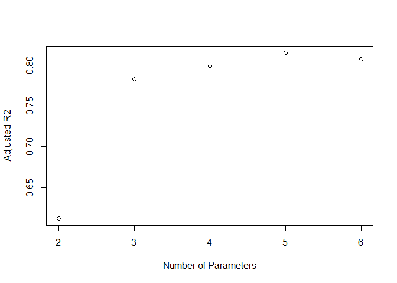

Multiple Regression 2
================

This is an [R Markdown](http://rmarkdown.rstudio.com) Notebook. When you
execute code within the notebook, the results appear beneath the code.

Try executing this chunk by clicking the *Run* button within the chunk
or by placing your cursor inside it and pressing *Ctrl+Shift+Enter*.

``` r
library(Sleuth2)
```

    ## Warning: package 'Sleuth2' was built under R version 4.3.3

``` r
library(corrplot)
```

    ## Warning: package 'corrplot' was built under R version 4.3.3

    ## corrplot 0.95 loaded

``` r
library(car)
```

    ## Warning: package 'car' was built under R version 4.3.3

    ## Loading required package: carData

    ## Warning: package 'carData' was built under R version 4.3.3

``` r
library(olsrr)
```

    ## Warning: package 'olsrr' was built under R version 4.3.3

    ## 
    ## Attaching package: 'olsrr'

    ## The following object is masked from 'package:datasets':
    ## 
    ##     rivers

``` r
turtleData=ex1220
summary(turtleData)
```

    ##     Island              Total            Native           Area         
    ##  Length:30          Min.   :  2.00   Min.   : 1.00   Min.   :   0.010  
    ##  Class :character   1st Qu.: 13.00   1st Qu.: 8.25   1st Qu.:   0.398  
    ##  Mode  :character   Median : 42.00   Median :18.00   Median :   2.590  
    ##                     Mean   : 85.23   Mean   :26.50   Mean   : 261.742  
    ##                     3rd Qu.: 96.00   3rd Qu.:32.25   3rd Qu.:  59.238  
    ##                     Max.   :444.00   Max.   :95.00   Max.   :4669.320  
    ##       Elev           DistNear         DistSC          AreaNear      
    ##  Min.   :  25.0   Min.   : 0.20   Min.   :  0.00   Min.   :   0.03  
    ##  1st Qu.: 109.8   1st Qu.: 0.80   1st Qu.: 11.03   1st Qu.:   0.52  
    ##  Median : 192.0   Median : 3.05   Median : 46.65   Median :   2.59  
    ##  Mean   : 368.4   Mean   :10.06   Mean   : 56.98   Mean   : 261.10  
    ##  3rd Qu.: 435.2   3rd Qu.:10.03   3rd Qu.: 81.08   3rd Qu.:  59.24  
    ##  Max.   :1707.0   Max.   :47.40   Max.   :290.20   Max.   :4669.32

``` r
pairwise_corr= cor(turtleData[,2:8])
corrplot(pairwise_corr)
```

<!-- -->

``` r
pairs(turtleData[,2:8])
```

<!-- -->

# Exhausted search

``` r
library(leaps)
```

    ## Warning: package 'leaps' was built under R version 4.3.3

``` r
b = regsubsets(Native~Area+Elev+DistNear+DistSC+AreaNear,data=turtleData)
rs = summary(b)
rs$which
```

    ##   (Intercept)  Area Elev DistNear DistSC AreaNear
    ## 1        TRUE FALSE TRUE    FALSE  FALSE    FALSE
    ## 2        TRUE FALSE TRUE    FALSE  FALSE     TRUE
    ## 3        TRUE  TRUE TRUE    FALSE  FALSE     TRUE
    ## 4        TRUE  TRUE TRUE    FALSE   TRUE     TRUE
    ## 5        TRUE  TRUE TRUE     TRUE   TRUE     TRUE

``` r
n=30
p=6
x_count=I(2:p)
AIC = n*log(rs$rss/n) + (2:p)*2
plot(x_count,AIC, ylab="AIC", xlab="Number of Parameters")
```

<!-- -->

``` r
n=30
p=6
x_count=I(2:p)
BIC = rs$bic
plot(x_count,BIC, ylab="BIC", xlab="Number of Parameters")
```

<!-- -->

``` r
n=30
p=6
x_count=I(2:p)
R2_a = rs$adjr2
plot(x_count,R2_a, ylab="Adjusted R2", xlab="Number of Parameters")
```

<!-- -->

``` r
n=30
p=6
x_count=I(2:p)
Cp = rs$cp
plot(x_count,Cp, ylab="Cp Statistics", xlab="Number of Parameters")
abline(0,1)
```

<!-- -->

# Cheaper alternative (used when there are many possible predictors)

It bears some comparison to the step wise methods, but only in the
method of search — there is no hypothesis testing.

``` r
allNumericalDataModel=lm(Native~Area+Elev+DistNear+DistSC+AreaNear,data=turtleData)
step(allNumericalDataModel,direction='forward')
```

    ## Start:  AIC=153.77
    ## Native ~ Area + Elev + DistNear + DistSC + AreaNear

    ## 
    ## Call:
    ## lm(formula = Native ~ Area + Elev + DistNear + DistSC + AreaNear, 
    ##     data = turtleData)
    ## 
    ## Coefficients:
    ## (Intercept)         Area         Elev     DistNear       DistSC     AreaNear  
    ##    5.782589    -0.008573     0.083518     0.025615    -0.060360    -0.017715

``` r
step(allNumericalDataModel,direction='backward')
```

    ## Start:  AIC=153.77
    ## Native ~ Area + Elev + DistNear + DistSC + AreaNear
    ## 
    ##            Df Sum of Sq     RSS    AIC
    ## - DistNear  1       2.2  3386.0 151.79
    ## <none>                   3383.8 153.77
    ## - DistSC    1     291.7  3675.5 154.25
    ## - Area      1     537.7  3921.4 156.19
    ## - AreaNear  1    3660.1  7043.8 173.76
    ## - Elev      1    8824.8 12208.6 190.26
    ## 
    ## Step:  AIC=151.79
    ## Native ~ Area + Elev + DistSC + AreaNear
    ## 
    ##            Df Sum of Sq     RSS    AIC
    ## <none>                   3386.0 151.79
    ## - DistSC    1     429.2  3815.1 153.37
    ## - Area      1     576.8  3962.7 154.50
    ## - AreaNear  1    4045.1  7431.1 173.37
    ## - Elev      1    9422.1 12808.1 189.70

    ## 
    ## Call:
    ## lm(formula = Native ~ Area + Elev + DistSC + AreaNear, data = turtleData)
    ## 
    ## Coefficients:
    ## (Intercept)         Area         Elev       DistSC     AreaNear  
    ##    5.800765    -0.008687     0.083831    -0.057085    -0.017839

``` r
step(allNumericalDataModel,direction='both')
```

    ## Start:  AIC=153.77
    ## Native ~ Area + Elev + DistNear + DistSC + AreaNear
    ## 
    ##            Df Sum of Sq     RSS    AIC
    ## - DistNear  1       2.2  3386.0 151.79
    ## <none>                   3383.8 153.77
    ## - DistSC    1     291.7  3675.5 154.25
    ## - Area      1     537.7  3921.4 156.19
    ## - AreaNear  1    3660.1  7043.8 173.76
    ## - Elev      1    8824.8 12208.6 190.26
    ## 
    ## Step:  AIC=151.79
    ## Native ~ Area + Elev + DistSC + AreaNear
    ## 
    ##            Df Sum of Sq     RSS    AIC
    ## <none>                   3386.0 151.79
    ## - DistSC    1     429.2  3815.1 153.37
    ## + DistNear  1       2.2  3383.8 153.77
    ## - Area      1     576.8  3962.7 154.50
    ## - AreaNear  1    4045.1  7431.1 173.37
    ## - Elev      1    9422.1 12808.1 189.70

    ## 
    ## Call:
    ## lm(formula = Native ~ Area + Elev + DistSC + AreaNear, data = turtleData)
    ## 
    ## Coefficients:
    ## (Intercept)         Area         Elev       DistSC     AreaNear  
    ##    5.800765    -0.008687     0.083831    -0.057085    -0.017839

# Sensitivity to outliers and leverage points

``` r
plot(allNumericalDataModel)
```

<!-- --><!-- --><!-- -->

    ## Warning in sqrt(crit * p * (1 - hh)/hh): NaNs produced
    ## Warning in sqrt(crit * p * (1 - hh)/hh): NaNs produced

<!-- -->

``` r
b_16<-regsubsets(Native~Area+Elev+DistNear+DistSC+AreaNear,data=turtleData, subset=(Island!="Isabela"))
rs_16 = summary(b_16)
rs_16$which
```

    ##   (Intercept)  Area  Elev DistNear DistSC AreaNear
    ## 1        TRUE  TRUE FALSE    FALSE  FALSE    FALSE
    ## 2        TRUE FALSE  TRUE    FALSE  FALSE     TRUE
    ## 3        TRUE  TRUE  TRUE    FALSE  FALSE     TRUE
    ## 4        TRUE  TRUE  TRUE    FALSE   TRUE     TRUE
    ## 5        TRUE  TRUE  TRUE     TRUE   TRUE     TRUE

``` r
n=29
p=6
x_count=I(2:p)
AIC = n*log(rs_16$rss/n) + (2:p)*2
plot(x_count,AIC, ylab="AIC", xlab="Number of Parameters")
```

<!-- -->

``` r
BIC = rs_16$bic
plot(x_count,BIC, ylab="BIC", xlab="Number of Parameters")
```

<!-- -->

``` r
R2_a = rs_16$adjr2
plot(x_count,R2_a, ylab="Adjusted R2", xlab="Number of Parameters")
```

<!-- -->

``` r
Cp = rs_16$cp
plot(x_count,Cp, ylab="Cp Statistics", xlab="Number of Parameters")
abline(0,1)
```

<!-- -->

``` r
h =lm.influence(allNumericalDataModel)$hat
names(h) =turtleData$Island
rev(sort(h))
```

    ##        Isabela     Fernandina         Darwin       Genovesa  San Cristobal 
    ##     0.96868083     0.94830162     0.46541445     0.43258423     0.37539528 
    ##           Wolf   San Salvador          Pinta     Santa Cruz    Santa Maria 
    ##     0.33346059     0.27213853     0.24983795     0.18034191     0.17089130 
    ##        Coamano Gardner (Esp.)       Marchena         Pinzon       Wspanola 
    ##     0.14658847     0.11809393     0.10355717     0.09829192     0.09825585 
    ##      Bartolome           Eden       Santa Fe     Las Plazas         Baltra 
    ##     0.09241681     0.08644379     0.08553377     0.07785569     0.07618616 
    ##         Onslow       Champion   Daphne Major   Daphne Minor        Seymour 
    ##     0.07380153     0.07264524     0.07192282     0.06861252     0.06245587 
    ##       Caldwell        Enderby         Rabida Gardner (S.M.)        Tortuga 
    ##     0.06236319     0.05939867     0.05354741     0.05276546     0.04221701

``` r
b_12<-regsubsets(Native~Area+Elev+DistNear+DistSC+AreaNear,data=turtleData, subset=(Island!="Fernandina"))
rs_12 = summary(b_12)
rs_12$which
```

    ##   (Intercept)  Area Elev DistNear DistSC AreaNear
    ## 1        TRUE FALSE TRUE    FALSE  FALSE    FALSE
    ## 2        TRUE  TRUE TRUE    FALSE  FALSE    FALSE
    ## 3        TRUE  TRUE TRUE    FALSE   TRUE    FALSE
    ## 4        TRUE  TRUE TRUE    FALSE   TRUE     TRUE
    ## 5        TRUE  TRUE TRUE     TRUE   TRUE     TRUE

``` r
n=29
p=6
x_count=I(2:p)
AIC = n*log(rs_12$rss/n) + (2:p)*2
plot(x_count,AIC, ylab="AIC", xlab="Number of Parameters")
```

<!-- -->

``` r
BIC = rs_12$bic
plot(x_count,BIC, ylab="BIC", xlab="Number of Parameters")
```

<!-- -->

``` r
R2_a = rs_12$adjr2
plot(x_count,R2_a, ylab="Adjusted R2", xlab="Number of Parameters")
```

<!-- -->

``` r
Cp = rs_12$cp
plot(x_count,Cp, ylab="Cp Statistics", xlab="Number of Parameters")
abline(0,1)
```

<!-- -->

# Partial plots and effect plots

``` r
allNumericalDataModel
```

    ## 
    ## Call:
    ## lm(formula = Native ~ Area + Elev + DistNear + DistSC + AreaNear, 
    ##     data = turtleData)
    ## 
    ## Coefficients:
    ## (Intercept)         Area         Elev     DistNear       DistSC     AreaNear  
    ##    5.782589    -0.008573     0.083518     0.025615    -0.060360    -0.017715

``` r
Model_Elev=lm(Native~Elev,data=turtleData)
Model_Elev
```

    ## 
    ## Call:
    ## lm(formula = Native ~ Elev, data = turtleData)
    ## 
    ## Coefficients:
    ## (Intercept)         Elev  
    ##     7.81191      0.05073

``` r
plot(turtleData$Elev, turtleData$Native, xlab='Elevation',ylab="Native Species",main='Effect Plot')
abline(Model_Elev) #simple regression model

b=colMeans(turtleData[,2:8])
x=data.frame(Intercept=1, Area=b[3], Elev= turtleData$Elev, DistNear=b[5], DistSC= b[6], AreaNear=b[7])
```

    ## Warning in data.frame(Intercept = 1, Area = b[3], Elev = turtleData$Elev, : row
    ## names were found from a short variable and have been discarded

``` r
p =predict(allNumericalDataModel, x)
i=order(turtleData$Elev)
#lines(turtleData$Elev[i], p[i], lty=2)
lines(turtleData$Elev, p, col='red') #multiple regression model
```

<!-- -->

``` r
# partial residual plot
termplot(allNumericalDataModel, partial.resid=TRUE, terms=2)
```

<!-- -->

``` r
# partial regression plot
d = residuals(lm(Native ~  Area + DistNear + DistSC+AreaNear,turtleData))
m = residuals(lm(Elev ~ Area + DistNear + DistSC+AreaNear,turtleData))
plot(m,d,xlab="Elevation",ylab="Native species residuals")
abline(0,allNumericalDataModel$coefficient[3])
```

<!-- -->

Add a new chunk by clicking the *Insert Chunk* button on the toolbar or
by pressing *Ctrl+Alt+I*.

When you save the notebook, an HTML file containing the code and output
will be saved alongside it (click the *Preview* button or press
*Ctrl+Shift+K* to preview the HTML file).

The preview shows you a rendered HTML copy of the contents of the
editor. Consequently, unlike *Knit*, *Preview* does not run any R code
chunks. Instead, the output of the chunk when it was last run in the
editor is displayed.
