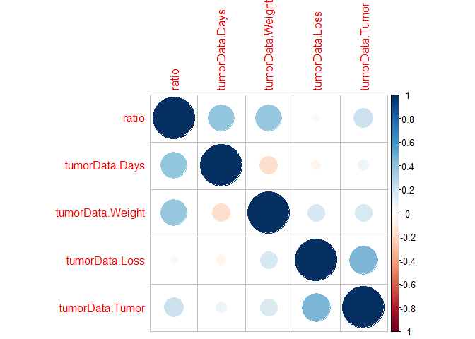
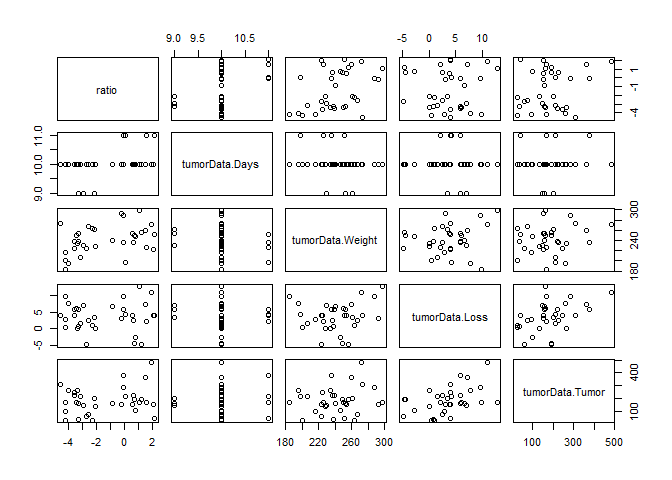

Multiple Regression 1
================

This is an [R Markdown](http://rmarkdown.rstudio.com) Notebook. When you
execute code within the notebook, the results appear beneath the code.

Try executing this chunk by clicking the *Run* button within the chunk
or by placing your cursor inside it and pressing *Ctrl+Shift+Enter*.

``` r
library(Sleuth2)
```

    ## Warning: package 'Sleuth2' was built under R version 4.3.3

``` r
library(corrplot)
```

    ## Warning: package 'corrplot' was built under R version 4.3.3

    ## corrplot 0.95 loaded

``` r
library(car)
```

    ## Warning: package 'car' was built under R version 4.3.3

    ## Loading required package: carData

    ## Warning: package 'carData' was built under R version 4.3.3

``` r
library(olsrr)
```

    ## Warning: package 'olsrr' was built under R version 4.3.3

    ## 
    ## Attaching package: 'olsrr'

    ## The following object is masked from 'package:datasets':
    ## 
    ##     rivers

``` r
tumorData=case1102
summary(tumorData)
```

    ##      Brain            Liver              Time        Treat        Days      
    ##  Min.   :  1334   Min.   :    928   Min.   : 0.500   BD:17   Min.   : 9.00  
    ##  1st Qu.: 19281   1st Qu.:  16210   1st Qu.: 1.125   NS:17   1st Qu.:10.00  
    ##  Median : 32573   Median : 643965   Median : 3.000           Median :10.00  
    ##  Mean   : 39965   Mean   : 668776   Mean   :23.515           Mean   :10.03  
    ##  3rd Qu.: 50654   3rd Qu.:1318557   3rd Qu.:24.000           3rd Qu.:10.00  
    ##  Max.   :123730   Max.   :1790863   Max.   :72.000           Max.   :11.00  
    ##  Sex        Weight           Loss            Tumor      
    ##  F:26   Min.   :184.0   Min.   :-4.900   Min.   : 25.0  
    ##  M: 8   1st Qu.:225.2   1st Qu.: 1.200   1st Qu.:136.2  
    ##         Median :239.5   Median : 3.950   Median :166.0  
    ##         Mean   :241.6   Mean   : 3.638   Mean   :182.9  
    ##         3rd Qu.:259.0   3rd Qu.: 5.975   3rd Qu.:223.2  
    ##         Max.   :298.0   Max.   :12.800   Max.   :484.0

# Checking multi-collinearity

``` r
ratio=log(tumorData$Brain/tumorData$Liver)
allNumericalData=data.frame(ratio,tumorData$Days, tumorData$Weight, tumorData$Loss, tumorData$Tumor)
pairwise_corr= cor(allNumericalData)
corrplot(pairwise_corr)
```

<!-- -->

``` r
pairs(allNumericalData)
```

<!-- -->

# Multiple Linear Regression

``` r
allNumericalDataModel=lm(ratio~.,data=allNumericalData)
summary(allNumericalDataModel)
```

    ## 
    ## Call:
    ## lm(formula = ratio ~ ., data = allNumericalData)
    ## 
    ## Residuals:
    ##     Min      1Q  Median      3Q     Max 
    ## -4.7035 -1.2275 -0.1909  1.4667  4.3216 
    ## 
    ## Coefficients:
    ##                    Estimate Std. Error t value Pr(>|t|)    
    ## (Intercept)      -33.727477   8.278431  -4.074 0.000327 ***
    ## tumorData.Days     2.270506   0.724583   3.134 0.003930 ** 
    ## tumorData.Weight   0.037820   0.012275   3.081 0.004488 ** 
    ## tumorData.Loss    -0.048089   0.086697  -0.555 0.583371    
    ## tumorData.Tumor    0.003296   0.003568   0.924 0.363204    
    ## ---
    ## Signif. codes:  0 '***' 0.001 '**' 0.01 '*' 0.05 '.' 0.1 ' ' 1
    ## 
    ## Residual standard error: 1.867 on 29 degrees of freedom
    ## Multiple R-squared:  0.3943, Adjusted R-squared:  0.3107 
    ## F-statistic: 4.719 on 4 and 29 DF,  p-value: 0.004677

- The regression equation is
  $y= -33.73+2.27x_1+0.04x_2-0.05x_3+0.003x_4$ where y is the log of the
  ratio of brain tumor concentration and liver tumor concentration,
  $x_1$ is the number of days post inoculation, $x_2$ is the initial
  weight, $x_3$ is the weight loss, and $x_4$ is the tumor weight.

- Interpretation: a unit increase in the number of days post inoculation
  ($x_1$) with the other predictors (initial weight, weight loss, and
  tumor weight) held constant will produce an increase of 2.27 in the
  log ratio of brain tumor concentration and liver tumor concentration.
  The effect is significant with p-value as 0.004.

- Interpretation: a unit increase in the initial weight ($x_2$) with the
  other predictors (number of days post inoculation, weight loss, and
  tumor weight) held constant will produce an increase of 0.04 in the
  log ratio of brain tumor concentration and liver tumor concentration.
  The effect is significant with p-value as 0.004.

- Interpretation: a unit increase in the weight loss ($x_3$) with the
  other predictors (number of days post inoculation, initial weight, and
  tumor weight) held constant will produce a decrease of 0.05 in the log
  ratio of brain tumor concentration and liver tumor concentration.

- Interpretation: a unit increase in the tumor weight ($x_4$) with the
  other predictors (number of days post inoculation, initial weight, and
  weight loss) held constant will produce an increase of 0.003 in the
  log ratio of brain tumor concentration and liver tumor concentration.

- The F test shown here is to take if any of the predictors are useful
  in predicting the response.

  - $H_0$: $\beta_1=\beta_2=\beta_3=\beta_4=0$. This is equivalent to
    the null model ($y=\beta_0$).
  - F statistics is 4.719 with DF as 4 (p-1) and 29 (n-p)
  - p value is 0.005
  - Thus, we reject the null hypothesis and conclude that some of the
    predictors are useful.

  ``` r
  vif(allNumericalDataModel)
  ```

      ##   tumorData.Days tumorData.Weight   tumorData.Loss  tumorData.Tumor 
      ##         1.050440         1.078862         1.281505         1.289975

  ``` r
  mean(vif(allNumericalDataModel))
  ```

      ## [1] 1.175196

# Variable Selection

``` r
ols_step_forward_p(allNumericalDataModel)
```

    ## 
    ## 
    ##                                 Stepwise Summary                                
    ## ------------------------------------------------------------------------------
    ## Step    Variable              AIC        SBC       SBIC       R2       Adj. R2 
    ## ------------------------------------------------------------------------------
    ##  0      Base Model          154.564    157.616    57.328    0.00000    0.00000 
    ##  1      tumorData.Days      150.733    155.312    53.568    0.15759    0.13127 
    ##  2      tumorData.Weight    142.534    148.640    46.836    0.37590    0.33564 
    ## ------------------------------------------------------------------------------
    ## 
    ## Final Model Output 
    ## ------------------
    ## 
    ##                          Model Summary                           
    ## ----------------------------------------------------------------
    ## R                       0.613       RMSE                  1.750 
    ## R-Squared               0.376       MSE                   3.062 
    ## Adj. R-Squared          0.336       Coef. Var          -131.961 
    ## Pred R-Squared          0.293       AIC                 142.534 
    ## MAE                     1.450       SBC                 148.640 
    ## ----------------------------------------------------------------
    ##  RMSE: Root Mean Square Error 
    ##  MSE: Mean Square Error 
    ##  MAE: Mean Absolute Error 
    ##  AIC: Akaike Information Criteria 
    ##  SBC: Schwarz Bayesian Criteria 
    ## 
    ##                               ANOVA                                
    ## ------------------------------------------------------------------
    ##                Sum of                                             
    ##               Squares        DF    Mean Square      F        Sig. 
    ## ------------------------------------------------------------------
    ## Regression     62.703         2         31.351    9.336     7e-04 
    ## Residual      104.103        31          3.358                    
    ## Total         166.806        33                                   
    ## ------------------------------------------------------------------
    ## 
    ##                                       Parameter Estimates                                        
    ## ------------------------------------------------------------------------------------------------
    ##            model       Beta    Std. Error    Std. Beta      t        Sig       lower      upper 
    ## ------------------------------------------------------------------------------------------------
    ##      (Intercept)    -34.421         8.093                 -4.253    0.000    -50.927    -17.914 
    ##   tumorData.Days      2.358         0.705        0.482     3.342    0.002      0.919      3.797 
    ## tumorData.Weight      0.039         0.012        0.475     3.293    0.002      0.015      0.063 
    ## ------------------------------------------------------------------------------------------------

``` r
ols_step_backward_p(allNumericalDataModel)
```

    ## 
    ## 
    ##                                Stepwise Summary                                
    ## -----------------------------------------------------------------------------
    ## Step    Variable             AIC        SBC       SBIC       R2       Adj. R2 
    ## -----------------------------------------------------------------------------
    ##  0      Full Model         145.518    154.676    50.694    0.39429    0.31075 
    ##  1      tumorData.Loss     143.876    151.508    48.618    0.38787    0.32665 
    ##  2      tumorData.Tumor    142.534    148.640    46.836    0.37590    0.33564 
    ## -----------------------------------------------------------------------------
    ## 
    ## Final Model Output 
    ## ------------------
    ## 
    ##                          Model Summary                           
    ## ----------------------------------------------------------------
    ## R                       0.613       RMSE                  1.750 
    ## R-Squared               0.376       MSE                   3.062 
    ## Adj. R-Squared          0.336       Coef. Var          -131.961 
    ## Pred R-Squared          0.293       AIC                 142.534 
    ## MAE                     1.450       SBC                 148.640 
    ## ----------------------------------------------------------------
    ##  RMSE: Root Mean Square Error 
    ##  MSE: Mean Square Error 
    ##  MAE: Mean Absolute Error 
    ##  AIC: Akaike Information Criteria 
    ##  SBC: Schwarz Bayesian Criteria 
    ## 
    ##                               ANOVA                                
    ## ------------------------------------------------------------------
    ##                Sum of                                             
    ##               Squares        DF    Mean Square      F        Sig. 
    ## ------------------------------------------------------------------
    ## Regression     62.703         2         31.351    9.336     7e-04 
    ## Residual      104.103        31          3.358                    
    ## Total         166.806        33                                   
    ## ------------------------------------------------------------------
    ## 
    ##                                       Parameter Estimates                                        
    ## ------------------------------------------------------------------------------------------------
    ##            model       Beta    Std. Error    Std. Beta      t        Sig       lower      upper 
    ## ------------------------------------------------------------------------------------------------
    ##      (Intercept)    -34.421         8.093                 -4.253    0.000    -50.927    -17.914 
    ##   tumorData.Days      2.358         0.705        0.482     3.342    0.002      0.919      3.797 
    ## tumorData.Weight      0.039         0.012        0.475     3.293    0.002      0.015      0.063 
    ## ------------------------------------------------------------------------------------------------

``` r
ols_step_both_p(allNumericalDataModel)
```

    ## 
    ## 
    ##                                   Stepwise Summary                                  
    ## ----------------------------------------------------------------------------------
    ## Step    Variable                  AIC        SBC       SBIC       R2       Adj. R2 
    ## ----------------------------------------------------------------------------------
    ##  0      Base Model              154.564    157.616    57.328    0.00000    0.00000 
    ##  1      tumorData.Days (+)      150.733    155.312    53.568    0.15759    0.13127 
    ##  2      tumorData.Weight (+)    142.534    148.640    46.836    0.37590    0.33564 
    ## ----------------------------------------------------------------------------------
    ## 
    ## Final Model Output 
    ## ------------------
    ## 
    ##                          Model Summary                           
    ## ----------------------------------------------------------------
    ## R                       0.613       RMSE                  1.750 
    ## R-Squared               0.376       MSE                   3.062 
    ## Adj. R-Squared          0.336       Coef. Var          -131.961 
    ## Pred R-Squared          0.293       AIC                 142.534 
    ## MAE                     1.450       SBC                 148.640 
    ## ----------------------------------------------------------------
    ##  RMSE: Root Mean Square Error 
    ##  MSE: Mean Square Error 
    ##  MAE: Mean Absolute Error 
    ##  AIC: Akaike Information Criteria 
    ##  SBC: Schwarz Bayesian Criteria 
    ## 
    ##                               ANOVA                                
    ## ------------------------------------------------------------------
    ##                Sum of                                             
    ##               Squares        DF    Mean Square      F        Sig. 
    ## ------------------------------------------------------------------
    ## Regression     62.703         2         31.351    9.336     7e-04 
    ## Residual      104.103        31          3.358                    
    ## Total         166.806        33                                   
    ## ------------------------------------------------------------------
    ## 
    ##                                       Parameter Estimates                                        
    ## ------------------------------------------------------------------------------------------------
    ##            model       Beta    Std. Error    Std. Beta      t        Sig       lower      upper 
    ## ------------------------------------------------------------------------------------------------
    ##      (Intercept)    -34.421         8.093                 -4.253    0.000    -50.927    -17.914 
    ##   tumorData.Days      2.358         0.705        0.482     3.342    0.002      0.919      3.797 
    ## tumorData.Weight      0.039         0.012        0.475     3.293    0.002      0.015      0.063 
    ## ------------------------------------------------------------------------------------------------

- The chosen model from all three methods is
  $y=-34.421+2.358x_1+0.039x_2$ where y is the log of the ratio of brain
  tumor concentration and liver tumor concentration, $x_1$ is the number
  of days post inoculation, $x_2$ is the initial weight.

# Add Categorical Variable

``` r
Model_Sex=lm(allNumericalData$ratio~tumorData$Days+tumorData$Weight+tumorData$Sex)
summary(Model_Sex)
```

    ## 
    ## Call:
    ## lm(formula = allNumericalData$ratio ~ tumorData$Days + tumorData$Weight + 
    ##     tumorData$Sex)
    ## 
    ## Residuals:
    ##    Min     1Q Median     3Q    Max 
    ## -3.068 -1.271 -0.203  0.980  4.366 
    ## 
    ## Coefficients:
    ##                   Estimate Std. Error t value Pr(>|t|)    
    ## (Intercept)      -27.90520    7.60274  -3.670 0.000936 ***
    ## tumorData$Days     2.19674    0.63574   3.455 0.001662 ** 
    ## tumorData$Weight   0.01622    0.01313   1.235 0.226450    
    ## tumorData$SexM     2.40246    0.82565   2.910 0.006754 ** 
    ## ---
    ## Signif. codes:  0 '***' 0.001 '**' 0.01 '*' 0.05 '.' 0.1 ' ' 1
    ## 
    ## Residual standard error: 1.645 on 30 degrees of freedom
    ## Multiple R-squared:  0.5133, Adjusted R-squared:  0.4646 
    ## F-statistic: 10.55 on 3 and 30 DF,  p-value: 6.729e-05

``` r
Anova(Model_Sex)
```

    ## Anova Table (Type II tests)
    ## 
    ## Response: allNumericalData$ratio
    ##                  Sum Sq Df F value   Pr(>F)   
    ## tumorData$Days   32.313  1 11.9400 0.001662 **
    ## tumorData$Weight  4.127  1  1.5250 0.226450   
    ## tumorData$Sex    22.914  1  8.4669 0.006754 **
    ## Residuals        81.189 30                    
    ## ---
    ## Signif. codes:  0 '***' 0.001 '**' 0.01 '*' 0.05 '.' 0.1 ' ' 1

- The equation of the model is $y=-27.91+2.20x_1+0.02x_2+2.40$ for male
  rats and $y=-27.91+2.20x_1+0.02x_2$ for female rats. Here $y$, $x_1$
  and $x_2$ have the same meaning as above equations.

- Interpretation: a unit increase in the number of days post inoculation
  ($x_1$) with the other predictors (initial weight and sex) held
  constant will produce an increase of 2.20 in the log ratio of brain
  tumor concentration and liver tumor concentration. The effect is
  significant with p-value as 0.002.

- Interpretation: a unit increase in the initial weight ($x_2$) with the
  other predictors (number of days post inoculation and sex) held
  constant will produce an increase of 0.02 in the log ratio of brain
  tumor concentration and liver tumor concentration.

- Interpretation: Given other predictors (number of days post
  inoculation and initial weight) held constant, a male rat will have an
  increase of 2.40 in the log ratio of brain tumor concentration and
  liver tumor concentration as compared to a female rat. The effect is
  significant with p-value as 0.007.

- We see that when we add the sex variable into the equation, the weight
  is not significant anymore. This can be explained that the sex and
  weight variables are related (male is usually heavier than female).

- The F test shown here is to take if any of the predictors are useful
  in predicting the response.

  - $H_0$: $\beta_1=\beta_2=\beta_3=0$. This is equivalent to the null
    model ($y=\beta_0$).
  - F statistics is 10.55 with DF as 3 (p-1) and 30 (n-p)
  - p value is 6.73 $\times 10^{-5}$
  - Thus, we reject the null hypothesis and conclude that some of the
    predictors are useful.

``` r
contrasts(tumorData$Sex)
```

    ##   M
    ## F 0
    ## M 1

``` r
Model_Treat=lm(allNumericalData$ratio~tumorData$Days+tumorData$Weight+tumorData$Treat)
summary(Model_Treat)
```

    ## 
    ## Call:
    ## lm(formula = allNumericalData$ratio ~ tumorData$Days + tumorData$Weight + 
    ##     tumorData$Treat)
    ## 
    ## Residuals:
    ##     Min      1Q  Median      3Q     Max 
    ## -4.0706 -1.2953 -0.1498  1.4647  3.9641 
    ## 
    ## Coefficients:
    ##                    Estimate Std. Error t value Pr(>|t|)    
    ## (Intercept)       -33.62177    8.20412  -4.098 0.000291 ***
    ## tumorData$Days      2.31604    0.71169   3.254 0.002814 ** 
    ## tumorData$Weight    0.03831    0.01188   3.224 0.003047 ** 
    ## tumorData$TreatNS  -0.50371    0.63467  -0.794 0.433629    
    ## ---
    ## Signif. codes:  0 '***' 0.001 '**' 0.01 '*' 0.05 '.' 0.1 ' ' 1
    ## 
    ## Residual standard error: 1.844 on 30 degrees of freedom
    ## Multiple R-squared:  0.3887, Adjusted R-squared:  0.3276 
    ## F-statistic:  6.36 on 3 and 30 DF,  p-value: 0.001817

``` r
Anova(Model_Treat)
```

    ## Anova Table (Type II tests)
    ## 
    ## Response: allNumericalData$ratio
    ##                   Sum Sq Df F value   Pr(>F)   
    ## tumorData$Days    35.994  1 10.5905 0.002814 **
    ## tumorData$Weight  35.319  1 10.3917 0.003047 **
    ## tumorData$Treat    2.141  1  0.6299 0.433629   
    ## Residuals        101.962 30                    
    ## ---
    ## Signif. codes:  0 '***' 0.001 '**' 0.01 '*' 0.05 '.' 0.1 ' ' 1

- The equation of the model is $y=-33.62+2.32x_1+0.04x_2-0.50$ for rats
  with normal saline (NS) treatment and $y=-33.62+2.32x_1+0.04x_2$ for
  rats with barrier disruption (BD) treatment (control group). Here $y$,
  $x_1$ and $x_2$ have the same meaning as above equations.

- Interpretation: a unit increase in the number of days post inoculation
  ($x_1$) with the other predictors (initial weight and treatment) held
  constant will produce an increase of 2.32 in the log ratio of brain
  tumor concentration and liver tumor concentration. The effect is
  significant with p-value as 0.003.

- Interpretation: a unit increase in the initial weight ($x_2$) with the
  other predictors (number of days post inoculation and treatment) held
  constant will produce an increase of 0.04 in the log ratio of brain
  tumor concentration and liver tumor concentration. The effect is
  significant with p-value as 0.003.

- Interpretation: Given other predictors (number of days post
  inoculation and initial weight) held constant, a rat going through NS
  treatment have a decrease of 0.5 in the log ratio of brain tumor
  concentration and liver tumor concentration as compared to a rat in
  the control group. However, there is not enough evidence to conclude
  that the effect is significant.

- The F test shown here is to take if any of the predictors are useful
  in predicting the response.

  - $H_0$: $\beta_1=\beta_2=\beta_3=0$. This is equivalent to the null
    model ($y=\beta_0$).
  - F statistics is 6.36 with DF as 3 (p-1) and 30 (n-p)
  - p value is 0.002\$
  - Thus, we reject the null hypothesis and conclude that some of the
    predictors are useful.

``` r
contrasts(tumorData$Treat)
```

    ##    NS
    ## BD  0
    ## NS  1

# Variable selection

``` r
Model_Sex_Treat=lm(allNumericalData$ratio~tumorData$Days+tumorData$Weight+tumorData$Sex+tumorData$Treat)
summary(Model_Sex_Treat)
```

    ## 
    ## Call:
    ## lm(formula = allNumericalData$ratio ~ tumorData$Days + tumorData$Weight + 
    ##     tumorData$Sex + tumorData$Treat)
    ## 
    ## Residuals:
    ##     Min      1Q  Median      3Q     Max 
    ## -2.7503 -1.1096 -0.2446  1.2229  4.0714 
    ## 
    ## Coefficients:
    ##                    Estimate Std. Error t value Pr(>|t|)   
    ## (Intercept)       -26.91886    7.66581  -3.512  0.00148 **
    ## tumorData$Days      2.14751    0.63760   3.368  0.00215 **
    ## tumorData$Weight    0.01532    0.01316   1.164  0.25385   
    ## tumorData$SexM      2.43418    0.82621   2.946  0.00629 **
    ## tumorData$TreatNS  -0.56770    0.56673  -1.002  0.32477   
    ## ---
    ## Signif. codes:  0 '***' 0.001 '**' 0.01 '*' 0.05 '.' 0.1 ' ' 1
    ## 
    ## Residual standard error: 1.645 on 29 degrees of freedom
    ## Multiple R-squared:  0.5296, Adjusted R-squared:  0.4647 
    ## F-statistic: 8.161 on 4 and 29 DF,  p-value: 0.0001548

``` r
Anova(Model_Sex_Treat)
```

    ## Anova Table (Type II tests)
    ## 
    ## Response: allNumericalData$ratio
    ##                  Sum Sq Df F value   Pr(>F)   
    ## tumorData$Days   30.697  1 11.3443 0.002152 **
    ## tumorData$Weight  3.667  1  1.3553 0.253846   
    ## tumorData$Sex    23.488  1  8.6802 0.006286 **
    ## tumorData$Treat   2.715  1  1.0034 0.324766   
    ## Residuals        78.473 29                    
    ## ---
    ## Signif. codes:  0 '***' 0.001 '**' 0.01 '*' 0.05 '.' 0.1 ' ' 1

- The equation of the model is
  $y=-26.92+2.15x_1+0.02x_2+2.43x_3-0.57x_4$. Here $y$, $x_1$, and $x_2$
  have the same meaning as above equations. $x_3$ is the sex (0 as F and
  1 as M), and $x_4$ denotes the treatment (0 as BD or control and 1 as
  NS).

- Interpretation: a unit increase in the number of days post inoculation
  ($x_1$) with the other predictors (initial weight, sex, and treatment)
  held constant will produce an increase of 2.15 in the log ratio of
  brain tumor concentration and liver tumor concentration. The effect is
  significant with p-value as 0.002.

- Interpretation: a unit increase in the initial weight ($x_2$) with the
  other predictors (number of days post inoculation,sex, and treatment)
  held constant will produce an increase of 0.02 in the log ratio of
  brain tumor concentration and liver tumor concentration.

- Interpretation: Given other predictors (number of days post
  inoculation, initial weight, and treatment) held constant, a male rat
  will have an increase of 2.43 in the log ratio of brain tumor
  concentration and liver tumor concentration as compared to a female
  rat. The effect is significant with p-value as 0.006.

- Interpretation: Given other predictors (number of days post
  inoculation, initial weight, and sex) held constant, a rat going
  through NS treatment have a decrease of 0.57 in the log ratio of brain
  tumor concentration and liver tumor concentration as compared to a rat
  in the control group. However, there is not enough evidence to
  conclude that the effect is significant.

- The F test shown here is to take if any of the predictors are useful
  in predicting the response.

  - $H_0$: $\beta_1=\beta_2=\beta_3=\beta_4=0$. This is equivalent to
    the null model ($y=\beta_0$).
  - F statistics is 8.161 with DF as 4 (p-1) and 29 (n-p)
  - p value is 0.0002
  - Thus, we reject the null hypothesis and conclude that some of the
    predictors are useful.

``` r
ols_step_forward_p(Model_Sex_Treat)
```

    ## 
    ## 
    ##                                 Stepwise Summary                                
    ## ------------------------------------------------------------------------------
    ## Step    Variable              AIC        SBC       SBIC       R2       Adj. R2 
    ## ------------------------------------------------------------------------------
    ##  0      Base Model          154.564    157.616    56.777    0.00000    0.00000 
    ##  1      tumorData$Sex       143.737    148.316    46.390    0.31426    0.29284 
    ##  2      tumorData$Days      135.768    141.873    39.738    0.48853    0.45553 
    ##  3      tumorData$Weight    136.082    143.714    40.624    0.51327    0.46460 
    ## ------------------------------------------------------------------------------
    ## 
    ## Final Model Output 
    ## ------------------
    ## 
    ##                          Model Summary                           
    ## ----------------------------------------------------------------
    ## R                       0.716       RMSE                  1.545 
    ## R-Squared               0.513       MSE                   2.388 
    ## Adj. R-Squared          0.465       Coef. Var          -118.463 
    ## Pred R-Squared          0.396       AIC                 136.082 
    ## MAE                     1.271       SBC                 143.714 
    ## ----------------------------------------------------------------
    ##  RMSE: Root Mean Square Error 
    ##  MSE: Mean Square Error 
    ##  MAE: Mean Absolute Error 
    ##  AIC: Akaike Information Criteria 
    ##  SBC: Schwarz Bayesian Criteria 
    ## 
    ##                                ANOVA                                
    ## -------------------------------------------------------------------
    ##                Sum of                                              
    ##               Squares        DF    Mean Square      F         Sig. 
    ## -------------------------------------------------------------------
    ## Regression     85.617         3         28.539    10.545     1e-04 
    ## Residual       81.189        30          2.706                     
    ## Total         166.806        33                                    
    ## -------------------------------------------------------------------
    ## 
    ##                                       Parameter Estimates                                        
    ## ------------------------------------------------------------------------------------------------
    ##            model       Beta    Std. Error    Std. Beta      t        Sig       lower      upper 
    ## ------------------------------------------------------------------------------------------------
    ##      (Intercept)    -27.905         7.603                 -3.670    0.001    -43.432    -12.378 
    ##   tumorData$SexM      2.402         0.826        0.460     2.910    0.007      0.716      4.089 
    ##   tumorData$Days      2.197         0.636        0.449     3.455    0.002      0.898      3.495 
    ## tumorData$Weight      0.016         0.013        0.198     1.235    0.226     -0.011      0.043 
    ## ------------------------------------------------------------------------------------------------

``` r
ols_step_backward_p(Model_Sex_Treat)
```

    ## 
    ## 
    ##                                Stepwise Summary                                
    ## -----------------------------------------------------------------------------
    ## Step    Variable             AIC        SBC       SBIC       R2       Adj. R2 
    ## -----------------------------------------------------------------------------
    ##  0      Full Model         136.925    146.084    42.102    0.52955    0.46466 
    ##  1      tumorData$Treat    136.082    143.714    40.624    0.51327    0.46460 
    ## -----------------------------------------------------------------------------
    ## 
    ## Final Model Output 
    ## ------------------
    ## 
    ##                          Model Summary                           
    ## ----------------------------------------------------------------
    ## R                       0.716       RMSE                  1.545 
    ## R-Squared               0.513       MSE                   2.388 
    ## Adj. R-Squared          0.465       Coef. Var          -118.463 
    ## Pred R-Squared          0.396       AIC                 136.082 
    ## MAE                     1.271       SBC                 143.714 
    ## ----------------------------------------------------------------
    ##  RMSE: Root Mean Square Error 
    ##  MSE: Mean Square Error 
    ##  MAE: Mean Absolute Error 
    ##  AIC: Akaike Information Criteria 
    ##  SBC: Schwarz Bayesian Criteria 
    ## 
    ##                                ANOVA                                
    ## -------------------------------------------------------------------
    ##                Sum of                                              
    ##               Squares        DF    Mean Square      F         Sig. 
    ## -------------------------------------------------------------------
    ## Regression     85.617         3         28.539    10.545     1e-04 
    ## Residual       81.189        30          2.706                     
    ## Total         166.806        33                                    
    ## -------------------------------------------------------------------
    ## 
    ##                                       Parameter Estimates                                        
    ## ------------------------------------------------------------------------------------------------
    ##            model       Beta    Std. Error    Std. Beta      t        Sig       lower      upper 
    ## ------------------------------------------------------------------------------------------------
    ##      (Intercept)    -27.905         7.603                 -3.670    0.001    -43.432    -12.378 
    ##   tumorData$Days      2.197         0.636        0.449     3.455    0.002      0.898      3.495 
    ## tumorData$Weight      0.016         0.013        0.198     1.235    0.226     -0.011      0.043 
    ##   tumorData$SexM      2.402         0.826        0.460     2.910    0.007      0.716      4.089 
    ## ------------------------------------------------------------------------------------------------

``` r
ols_step_both_p(Model_Sex_Treat)
```

    ## 
    ## 
    ##                                  Stepwise Summary                                 
    ## --------------------------------------------------------------------------------
    ## Step    Variable                AIC        SBC       SBIC       R2       Adj. R2 
    ## --------------------------------------------------------------------------------
    ##  0      Base Model            154.564    157.616    56.777    0.00000    0.00000 
    ##  1      tumorData$Sex (+)     143.737    148.316    46.390    0.31426    0.29284 
    ##  2      tumorData$Days (+)    135.768    141.873    39.738    0.48853    0.45553 
    ## --------------------------------------------------------------------------------
    ## 
    ## Final Model Output 
    ## ------------------
    ## 
    ##                          Model Summary                           
    ## ----------------------------------------------------------------
    ## R                       0.699       RMSE                  1.584 
    ## R-Squared               0.489       MSE                   2.509 
    ## Adj. R-Squared          0.456       Coef. Var          -119.462 
    ## Pred R-Squared          0.406       AIC                 135.768 
    ## MAE                     1.269       SBC                 141.873 
    ## ----------------------------------------------------------------
    ##  RMSE: Root Mean Square Error 
    ##  MSE: Mean Square Error 
    ##  MAE: Mean Absolute Error 
    ##  AIC: Akaike Information Criteria 
    ##  SBC: Schwarz Bayesian Criteria 
    ## 
    ##                                ANOVA                                
    ## -------------------------------------------------------------------
    ##                Sum of                                              
    ##               Squares        DF    Mean Square      F         Sig. 
    ## -------------------------------------------------------------------
    ## Regression     81.490         2         40.745    14.805    0.0000 
    ## Residual       85.316        31          2.752                     
    ## Total         166.806        33                                    
    ## -------------------------------------------------------------------
    ## 
    ##                                      Parameter Estimates                                      
    ## ---------------------------------------------------------------------------------------------
    ##          model       Beta    Std. Error    Std. Beta      t        Sig       lower     upper 
    ## ---------------------------------------------------------------------------------------------
    ##    (Intercept)    -22.590         6.320                 -3.574    0.001    -35.480    -9.700 
    ## tumorData$SexM      3.006         0.671        0.576     4.479    0.000      1.637     4.375 
    ## tumorData$Days      2.043         0.629        0.418     3.250    0.003      0.761     3.326 
    ## ---------------------------------------------------------------------------------------------

``` r
Model_chosen=lm(allNumericalData$ratio~tumorData$Days+tumorData$Sex)
summary(Model_chosen)
```

    ## 
    ## Call:
    ## lm(formula = allNumericalData$ratio ~ tumorData$Days + tumorData$Sex)
    ## 
    ## Residuals:
    ##     Min      1Q  Median      3Q     Max 
    ## -2.4222 -1.2249 -0.0972  1.0080  4.2010 
    ## 
    ## Coefficients:
    ##                Estimate Std. Error t value Pr(>|t|)    
    ## (Intercept)    -22.5903     6.3201  -3.574  0.00117 ** 
    ## tumorData$Days   2.0434     0.6288   3.250  0.00278 ** 
    ## tumorData$SexM   3.0059     0.6712   4.479 9.51e-05 ***
    ## ---
    ## Signif. codes:  0 '***' 0.001 '**' 0.01 '*' 0.05 '.' 0.1 ' ' 1
    ## 
    ## Residual standard error: 1.659 on 31 degrees of freedom
    ## Multiple R-squared:  0.4885, Adjusted R-squared:  0.4555 
    ## F-statistic:  14.8 on 2 and 31 DF,  p-value: 3.067e-05

``` r
Anova(Model_chosen)
```

    ## Anova Table (Type II tests)
    ## 
    ## Response: allNumericalData$ratio
    ##                Sum Sq Df F value    Pr(>F)    
    ## tumorData$Days 29.069  1  10.562  0.002778 ** 
    ## tumorData$Sex  55.202  1  20.058 9.512e-05 ***
    ## Residuals      85.316 31                      
    ## ---
    ## Signif. codes:  0 '***' 0.001 '**' 0.01 '*' 0.05 '.' 0.1 ' ' 1

- The equation of the model is $y=-22.59+2.04x_1+3.01x_3$. Here $y$ and
  $x_1$. $x_3$ is the sex (0 as F and 1 as M).

- Interpretation: a unit increase in the number of days post inoculation
  ($x_1$) with the other predictor (sex) held constant will produce an
  increase of 2.03 in the log ratio of brain tumor concentration and
  liver tumor concentration. The effect is significant with p-value as
  0.003.

- Interpretation: Given other predictor (number of days post
  inoculation) held constant, a male rat will have an increase of 3.01
  in the log ratio of brain tumor concentration and liver tumor
  concentration as compared to a female rat. The effect is significant
  with p-value as $9.51 \times 10^{-5}$.

- The F test shown here is to take if any of the predictors are useful
  in predicting the response.

  - $H_0$: $\beta_1=\beta_3=0$. This is equivalent to the null model
    ($y=\beta_0$).
  - F statistics is 14.8 with DF as 2 (p-1) and 31 (n-p)
  - p value is $3.07 \times 10^{-5}$
  - Thus, we reject the null hypothesis and conclude that some of the
    predictors are useful.

Add a new chunk by clicking the *Insert Chunk* button on the toolbar or
by pressing *Ctrl+Alt+I*.

When you save the notebook, an HTML file containing the code and output
will be saved alongside it (click the *Preview* button or press
*Ctrl+Shift+K* to preview the HTML file).

The preview shows you a rendered HTML copy of the contents of the
editor. Consequently, unlike *Knit*, *Preview* does not run any R code
chunks. Instead, the output of the chunk when it was last run in the
editor is displayed.
