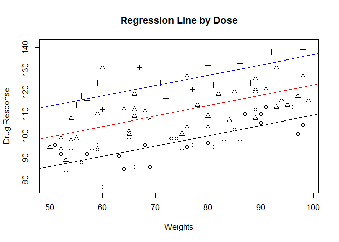

R Notebook
================

This is an [R Markdown](http://rmarkdown.rstudio.com) Notebook. When you
execute code within the notebook, the results appear beneath the code.

Try executing this chunk by clicking the *Run* button within the chunk
or by placing your cursor inside it and pressing *Ctrl+Shift+Enter*.

``` r
ANCOVAdata=read.csv("ANCOVA_drug_response.csv")
dose=factor(ANCOVAdata$Drug.Dose)
```

``` r
Model_1=lm(Drug.Response~dose+Weight..in.kg., data=ANCOVAdata)
summary(Model_1)
```

    ## 
    ## Call:
    ## lm(formula = Drug.Response ~ dose + Weight..in.kg., data = ANCOVAdata)
    ## 
    ## Residuals:
    ##      Min       1Q   Median       3Q      Max 
    ## -13.9015  -4.9390  -0.3035   4.9289  26.6187 
    ## 
    ## Coefficients:
    ##                Estimate Std. Error t value Pr(>|t|)    
    ## (Intercept)    62.95310    3.53268   17.82  < 2e-16 ***
    ## dose2          13.47977    1.55481    8.67 1.07e-13 ***
    ## dose3          27.23099    1.74280   15.62  < 2e-16 ***
    ## Weight..in.kg.  0.46581    0.04576   10.18  < 2e-16 ***
    ## ---
    ## Signif. codes:  0 '***' 0.001 '**' 0.01 '*' 0.05 '.' 0.1 ' ' 1
    ## 
    ## Residual standard error: 6.724 on 96 degrees of freedom
    ## Multiple R-squared:  0.7798, Adjusted R-squared:  0.7729 
    ## F-statistic: 113.3 on 3 and 96 DF,  p-value: < 2.2e-16

``` r
anova(Model_1)
```

    ## Analysis of Variance Table
    ## 
    ## Response: Drug.Response
    ##                Df  Sum Sq Mean Sq F value    Pr(>F)    
    ## dose            2 10685.9  5343.0  118.18 < 2.2e-16 ***
    ## Weight..in.kg.  1  4684.6  4684.6  103.62 < 2.2e-16 ***
    ## Residuals      96  4340.1    45.2                      
    ## ---
    ## Signif. codes:  0 '***' 0.001 '**' 0.01 '*' 0.05 '.' 0.1 ' ' 1

``` r
plot(ANCOVAdata$Weight..in.kg., ANCOVAdata$Drug.Response, pch=ANCOVAdata$Drug.Dose, xlab='Weights', ylab='Drug Response',main='Regression Line by Dose')
abline(Model_1$coefficients[1], Model_1$coefficients[4])# dose 1
abline(Model_1$coefficients[1]+ Model_1$coefficients[2], Model_1$coefficients[4],col='red')#dose 2
abline(Model_1$coefficients[1]+ Model_1$coefficients[3], Model_1$coefficients[4],col='blue')#dose 3
```

<!-- -->

``` r
Model_2=lm(Drug.Response~dose+Weight..in.kg.+dose:Weight..in.kg., data=ANCOVAdata)
summary(Model_2)
```

    ## 
    ## Call:
    ## lm(formula = Drug.Response ~ dose + Weight..in.kg. + dose:Weight..in.kg., 
    ##     data = ANCOVAdata)
    ## 
    ## Residuals:
    ##      Min       1Q   Median       3Q      Max 
    ## -13.8731  -5.3914   0.2623   4.6705  26.1196 
    ## 
    ## Coefficients:
    ##                      Estimate Std. Error t value Pr(>|t|)    
    ## (Intercept)          62.79634    5.73011  10.959  < 2e-16 ***
    ## dose2                16.13214    7.93866   2.032   0.0450 *  
    ## dose3                23.28409    9.09936   2.559   0.0121 *  
    ## Weight..in.kg.        0.46795    0.07666   6.104  2.3e-08 ***
    ## dose2:Weight..in.kg. -0.03541    0.10502  -0.337   0.7367    
    ## dose3:Weight..in.kg.  0.05527    0.12368   0.447   0.6560    
    ## ---
    ## Signif. codes:  0 '***' 0.001 '**' 0.01 '*' 0.05 '.' 0.1 ' ' 1
    ## 
    ## Residual standard error: 6.775 on 94 degrees of freedom
    ## Multiple R-squared:  0.7811, Adjusted R-squared:  0.7695 
    ## F-statistic: 67.09 on 5 and 94 DF,  p-value: < 2.2e-16

``` r
anova(Model_2)
```

    ## Analysis of Variance Table
    ## 
    ## Response: Drug.Response
    ##                     Df  Sum Sq Mean Sq  F value Pr(>F)    
    ## dose                 2 10685.9  5343.0 116.4179 <2e-16 ***
    ## Weight..in.kg.       1  4684.6  4684.6 102.0729 <2e-16 ***
    ## dose:Weight..in.kg.  2    26.0    13.0   0.2828 0.7543    
    ## Residuals           94  4314.1    45.9                    
    ## ---
    ## Signif. codes:  0 '***' 0.001 '**' 0.01 '*' 0.05 '.' 0.1 ' ' 1

``` r
model.matrix(Model_2)
```

    ##     (Intercept) dose2 dose3 Weight..in.kg. dose2:Weight..in.kg.
    ## 1             1     0     0             69                    0
    ## 2             1     1     0             98                   98
    ## 3             1     0     0             87                    0
    ## 4             1     1     0             80                   80
    ## 5             1     0     1             58                    0
    ## 6             1     0     0             58                    0
    ## 7             1     1     0             53                   53
    ## 8             1     1     0             93                   93
    ## 9             1     0     0             80                    0
    ## 10            1     0     0             85                    0
    ## 11            1     0     0             51                    0
    ## 12            1     0     0             98                    0
    ## 13            1     0     1             92                    0
    ## 14            1     0     1             61                    0
    ## 15            1     1     0             59                   59
    ## 16            1     0     1             59                    0
    ## 17            1     0     1             65                    0
    ## 18            1     0     0             76                    0
    ## 19            1     0     1             72                    0
    ## 20            1     1     0             65                   65
    ## 21            1     0     1             81                    0
    ## 22            1     0     1             57                    0
    ## 23            1     0     0             65                    0
    ## 24            1     0     0             68                    0
    ## 25            1     0     0             73                    0
    ## 26            1     1     0             89                   89
    ## 27            1     0     1             60                    0
    ## 28            1     0     1             76                    0
    ## 29            1     0     0             80                    0
    ## 30            1     1     0             52                   52
    ## 31            1     1     0             80                   80
    ## 32            1     0     0             59                    0
    ## 33            1     0     0             53                    0
    ## 34            1     1     0             97                   97
    ## 35            1     0     1             98                    0
    ## 36            1     0     0             90                    0
    ## 37            1     1     0             65                   65
    ## 38            1     1     0             55                   55
    ## 39            1     1     0             84                   84
    ## 40            1     0     1             72                    0
    ## 41            1     0     1             56                    0
    ## 42            1     0     0             75                    0
    ## 43            1     1     0             52                   52
    ## 44            1     0     0             95                    0
    ## 45            1     0     0             63                    0
    ## 46            1     0     0             83                    0
    ## 47            1     1     0             66                   66
    ## 48            1     1     0             76                   76
    ## 49            1     0     0             77                    0
    ## 50            1     0     0             59                    0
    ## 51            1     0     1             98                    0
    ## 52            1     0     0             89                    0
    ## 53            1     0     0             97                    0
    ## 54            1     1     0             95                   95
    ## 55            1     0     1             80                    0
    ## 56            1     0     0             96                    0
    ## 57            1     1     0             54                   54
    ## 58            1     1     0             60                   60
    ## 59            1     0     0             52                    0
    ## 60            1     1     0             66                   66
    ## 61            1     1     0             69                   69
    ## 62            1     1     0             64                   64
    ## 63            1     1     0             91                   91
    ## 64            1     1     0             68                   68
    ## 65            1     0     0             64                    0
    ## 66            1     0     1             77                    0
    ## 67            1     0     0             57                    0
    ## 68            1     0     0             90                    0
    ## 69            1     0     0             54                    0
    ## 70            1     1     0             99                   99
    ## 71            1     1     0             89                   89
    ## 72            1     0     0             60                    0
    ## 73            1     1     0             50                   50
    ## 74            1     0     0             91                    0
    ## 75            1     1     0             85                   85
    ## 76            1     0     0             86                    0
    ## 77            1     1     0             89                   89
    ## 78            1     1     0             54                   54
    ## 79            1     0     1             68                    0
    ## 80            1     0     0             56                    0
    ## 81            1     1     0             93                   93
    ## 82            1     0     0             81                    0
    ## 83            1     0     1             67                    0
    ## 84            1     0     1             53                    0
    ## 85            1     0     0             66                    0
    ## 86            1     1     0             66                   66
    ## 87            1     0     1             86                    0
    ## 88            1     1     0             82                   82
    ## 89            1     1     0             94                   94
    ## 90            1     0     0             74                    0
    ## 91            1     0     0             56                    0
    ## 92            1     0     1             86                    0
    ## 93            1     0     1             88                    0
    ## 94            1     1     0             78                   78
    ## 95            1     1     0             89                   89
    ## 96            1     1     0             75                   75
    ## 97            1     1     0             76                   76
    ## 98            1     0     1             71                    0
    ## 99            1     0     1             51                    0
    ## 100           1     0     1             55                    0
    ##     dose3:Weight..in.kg.
    ## 1                      0
    ## 2                      0
    ## 3                      0
    ## 4                      0
    ## 5                     58
    ## 6                      0
    ## 7                      0
    ## 8                      0
    ## 9                      0
    ## 10                     0
    ## 11                     0
    ## 12                     0
    ## 13                    92
    ## 14                    61
    ## 15                     0
    ## 16                    59
    ## 17                    65
    ## 18                     0
    ## 19                    72
    ## 20                     0
    ## 21                    81
    ## 22                    57
    ## 23                     0
    ## 24                     0
    ## 25                     0
    ## 26                     0
    ## 27                    60
    ## 28                    76
    ## 29                     0
    ## 30                     0
    ## 31                     0
    ## 32                     0
    ## 33                     0
    ## 34                     0
    ## 35                    98
    ## 36                     0
    ## 37                     0
    ## 38                     0
    ## 39                     0
    ## 40                    72
    ## 41                    56
    ## 42                     0
    ## 43                     0
    ## 44                     0
    ## 45                     0
    ## 46                     0
    ## 47                     0
    ## 48                     0
    ## 49                     0
    ## 50                     0
    ## 51                    98
    ## 52                     0
    ## 53                     0
    ## 54                     0
    ## 55                    80
    ## 56                     0
    ## 57                     0
    ## 58                     0
    ## 59                     0
    ## 60                     0
    ## 61                     0
    ## 62                     0
    ## 63                     0
    ## 64                     0
    ## 65                     0
    ## 66                    77
    ## 67                     0
    ## 68                     0
    ## 69                     0
    ## 70                     0
    ## 71                     0
    ## 72                     0
    ## 73                     0
    ## 74                     0
    ## 75                     0
    ## 76                     0
    ## 77                     0
    ## 78                     0
    ## 79                    68
    ## 80                     0
    ## 81                     0
    ## 82                     0
    ## 83                    67
    ## 84                    53
    ## 85                     0
    ## 86                     0
    ## 87                    86
    ## 88                     0
    ## 89                     0
    ## 90                     0
    ## 91                     0
    ## 92                    86
    ## 93                    88
    ## 94                     0
    ## 95                     0
    ## 96                     0
    ## 97                     0
    ## 98                    71
    ## 99                    51
    ## 100                   55
    ## attr(,"assign")
    ## [1] 0 1 1 2 3 3
    ## attr(,"contrasts")
    ## attr(,"contrasts")$dose
    ## [1] "contr.treatment"

Add a new chunk by clicking the *Insert Chunk* button on the toolbar or
by pressing *Ctrl+Alt+I*.

When you save the notebook, an HTML file containing the code and output
will be saved alongside it (click the *Preview* button or press
*Ctrl+Shift+K* to preview the HTML file).

The preview shows you a rendered HTML copy of the contents of the
editor. Consequently, unlike *Knit*, *Preview* does not run any R code
chunks. Instead, the output of the chunk when it was last run in the
editor is displayed.
