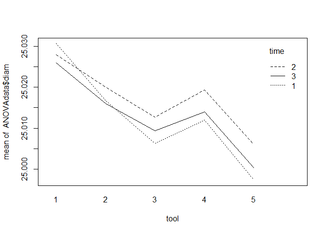
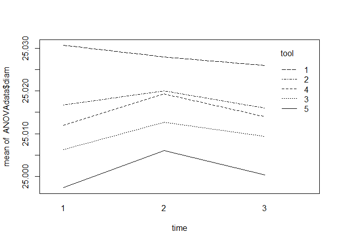
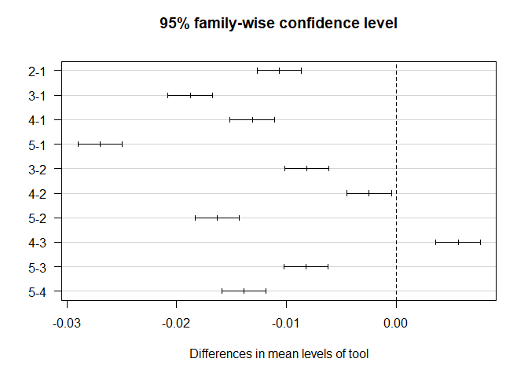
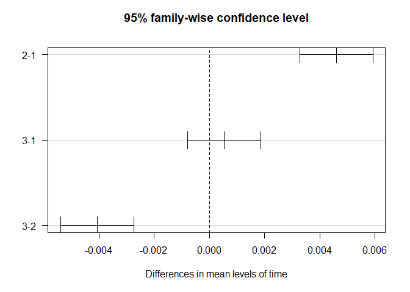
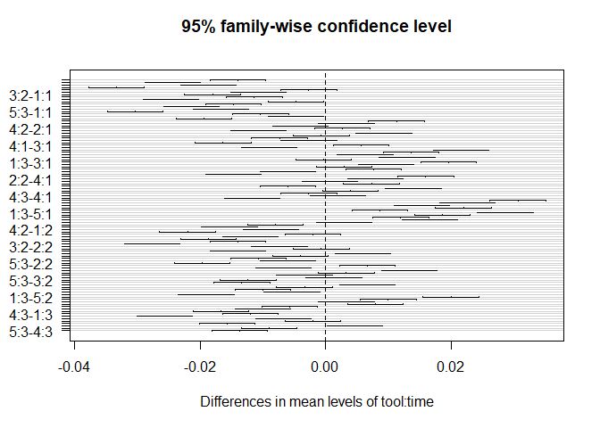
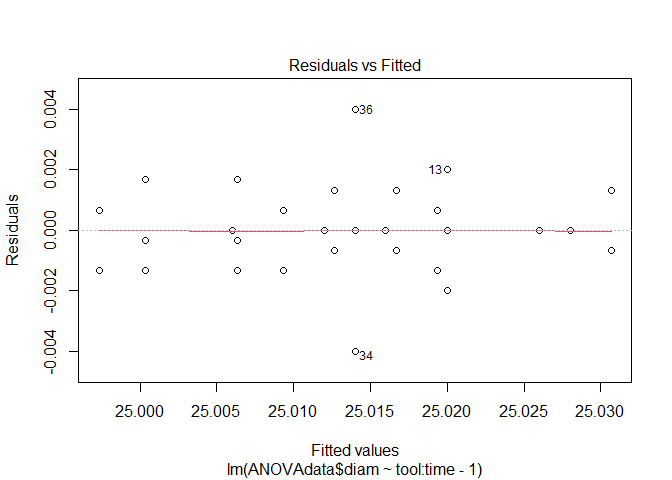
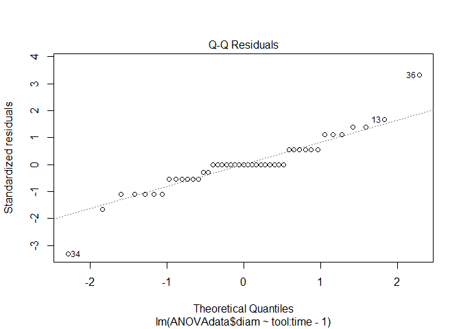
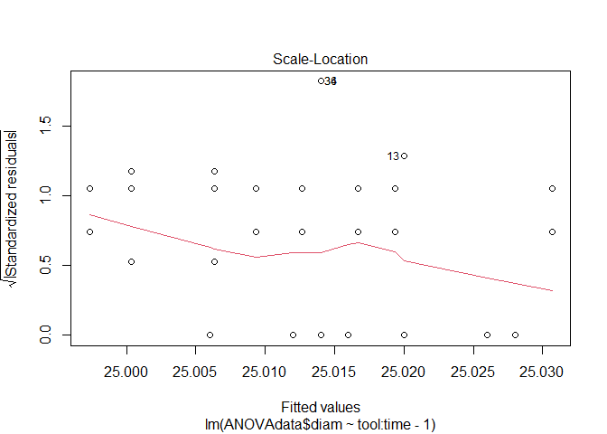
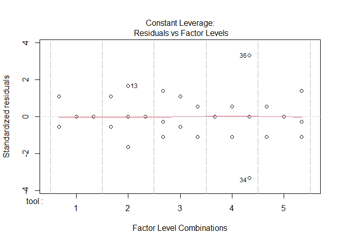

R Notebook
================

This is an [R Markdown](http://rmarkdown.rstudio.com) Notebook. When you
execute code within the notebook, the results appear beneath the code.

Try executing this chunk by clicking the *Run* button within the chunk
or by placing your cursor inside it and pressing *Ctrl+Shift+Enter*.

``` r
ANOVAdata=read.csv("ANOVAData.csv")
tool=factor(ANOVAdata$tool)#alerting R that "tool" is a factor
time=factor(ANOVAdata$time) #alerting R that "time" is a factor
table(tool,time)#the model is balanced
```

    ##     time
    ## tool 1 2 3
    ##    1 3 3 3
    ##    2 3 3 3
    ##    3 3 3 3
    ##    4 3 3 3
    ##    5 3 3 3

``` r
interaction.plot(tool,time,ANOVAdata$diam) #gives the plot of means 
```

<!-- -->

``` r
interaction.plot(time,tool,ANOVAdata$diam) #gives the plot of means 
```

<!-- -->

``` r
tool_time=aov(ANOVAdata$diam~tool+time+tool*time)#analyis of variance
summary(tool_time)
```

    ##             Df   Sum Sq   Mean Sq F value   Pr(>F)    
    ## tool         4 0.003597 0.0008993 412.944  < 2e-16 ***
    ## time         2 0.000190 0.0000950  43.602 1.33e-09 ***
    ## tool:time    8 0.000133 0.0000167   7.645 1.55e-05 ***
    ## Residuals   30 0.000065 0.0000022                     
    ## ---
    ## Signif. codes:  0 '***' 0.001 '**' 0.01 '*' 0.05 '.' 0.1 ' ' 1

``` r
TukeyHSD(tool_time,"tool") #multiple comparisons btwn the tool levels
```

    ##   Tukey multiple comparisons of means
    ##     95% family-wise confidence level
    ## 
    ## Fit: aov(formula = ANOVAdata$diam ~ tool + time + tool * time)
    ## 
    ## $tool
    ##             diff          lwr           upr     p adj
    ## 2-1 -0.010666667 -0.012684520 -0.0086488136 0.0000000
    ## 3-1 -0.018777778 -0.020795631 -0.0167599247 0.0000000
    ## 4-1 -0.013111111 -0.015128964 -0.0110932580 0.0000000
    ## 5-1 -0.027000000 -0.029017853 -0.0249821469 0.0000000
    ## 3-2 -0.008111111 -0.010128964 -0.0060932580 0.0000000
    ## 4-2 -0.002444444 -0.004462298 -0.0004265913 0.0115034
    ## 5-2 -0.016333333 -0.018351186 -0.0143154802 0.0000000
    ## 4-3  0.005666667  0.003648814  0.0076845198 0.0000000
    ## 5-3 -0.008222222 -0.010240075 -0.0062043691 0.0000000
    ## 5-4 -0.013888889 -0.015906742 -0.0118710358 0.0000000

``` r
plot(TukeyHSD(tool_time, "tool", conf.level=.95), las=1)
```

<!-- -->

``` r
TukeyHSD(tool_time,"time") #multiple comparisons btwn the time levels
```

    ##   Tukey multiple comparisons of means
    ##     95% family-wise confidence level
    ## 
    ## Fit: aov(formula = ANOVAdata$diam ~ tool + time + tool * time)
    ## 
    ## $time
    ##              diff           lwr          upr     p adj
    ## 2-1  0.0046000000  0.0032715633  0.005928437 0.0000000
    ## 3-1  0.0005333333 -0.0007951034  0.001861770 0.5889080
    ## 3-2 -0.0040666667 -0.0053951034 -0.002738230 0.0000001

``` r
plot(TukeyHSD(tool_time, "time", conf.level=.95), las=1)
```

<!-- -->

``` r
TukeyHSD(tool_time,"tool:time") #multiple comparisons for interaction 
```

    ##   Tukey multiple comparisons of means
    ##     95% family-wise confidence level
    ## 
    ## Fit: aov(formula = ANOVAdata$diam ~ tool + time + tool * time)
    ## 
    ## $`tool:time`
    ##                  diff           lwr           upr     p adj
    ## 2:1-1:1 -0.0140000000 -0.0184401711 -0.0095598289 0.0000000
    ## 3:1-1:1 -0.0243333333 -0.0287735045 -0.0198931622 0.0000000
    ## 4:1-1:1 -0.0186666667 -0.0231068378 -0.0142264955 0.0000000
    ## 5:1-1:1 -0.0333333333 -0.0377735045 -0.0288931622 0.0000000
    ## 1:2-1:1 -0.0026666667 -0.0071068378  0.0017735045 0.6542364
    ## 2:2-1:1 -0.0106666667 -0.0151068378 -0.0062264955 0.0000001
    ## 3:2-1:1 -0.0180000000 -0.0224401711 -0.0135598289 0.0000000
    ## 4:2-1:1 -0.0113333333 -0.0157735045 -0.0068931622 0.0000000
    ## 5:2-1:1 -0.0246666667 -0.0291068378 -0.0202264955 0.0000000
    ## 1:3-1:1 -0.0046666667 -0.0091068378 -0.0002264955 0.0321283
    ## 2:3-1:1 -0.0146666667 -0.0191068378 -0.0102264955 0.0000000
    ## 3:3-1:1 -0.0213333333 -0.0257735045 -0.0168931622 0.0000000
    ## 4:3-1:1 -0.0166666667 -0.0211068378 -0.0122264955 0.0000000
    ## 5:3-1:1 -0.0303333333 -0.0347735045 -0.0258931622 0.0000000
    ## 3:1-2:1 -0.0103333333 -0.0147735045 -0.0058931622 0.0000001
    ## 4:1-2:1 -0.0046666667 -0.0091068378 -0.0002264955 0.0321283
    ## 5:1-2:1 -0.0193333333 -0.0237735045 -0.0148931622 0.0000000
    ## 1:2-2:1  0.0113333333  0.0068931622  0.0157735045 0.0000000
    ## 2:2-2:1  0.0033333333 -0.0011068378  0.0077735045 0.3158281
    ## 3:2-2:1 -0.0040000000 -0.0084401711  0.0004401711 0.1119292
    ## 4:2-2:1  0.0026666667 -0.0017735045  0.0071068378 0.6542364
    ## 5:2-2:1 -0.0106666667 -0.0151068378 -0.0062264955 0.0000001
    ## 1:3-2:1  0.0093333333  0.0048931622  0.0137735045 0.0000011
    ## 2:3-2:1 -0.0006666667 -0.0051068378  0.0037735045 0.9999994
    ## 3:3-2:1 -0.0073333333 -0.0117735045 -0.0028931622 0.0000939
    ## 4:3-2:1 -0.0026666667 -0.0071068378  0.0017735045 0.6542364
    ## 5:3-2:1 -0.0163333333 -0.0207735045 -0.0118931622 0.0000000
    ## 4:1-3:1  0.0056666667  0.0012264955  0.0101068378 0.0039279
    ## 5:1-3:1 -0.0090000000 -0.0134401711 -0.0045598289 0.0000023
    ## 1:2-3:1  0.0216666667  0.0172264955  0.0261068378 0.0000000
    ## 2:2-3:1  0.0136666667  0.0092264955  0.0181068378 0.0000000
    ## 3:2-3:1  0.0063333333  0.0018931622  0.0107735045 0.0008950
    ## 4:2-3:1  0.0130000000  0.0085598289  0.0174401711 0.0000000
    ## 5:2-3:1 -0.0003333333 -0.0047735045  0.0041068378 1.0000000
    ## 1:3-3:1  0.0196666667  0.0152264955  0.0241068378 0.0000000
    ## 2:3-3:1  0.0096666667  0.0052264955  0.0141068378 0.0000006
    ## 3:3-3:1  0.0030000000 -0.0014401711  0.0074401711 0.4753970
    ## 4:3-3:1  0.0076666667  0.0032264955  0.0121068378 0.0000444
    ## 5:3-3:1 -0.0060000000 -0.0104401711 -0.0015598289 0.0018836
    ## 5:1-4:1 -0.0146666667 -0.0191068378 -0.0102264955 0.0000000
    ## 1:2-4:1  0.0160000000  0.0115598289  0.0204401711 0.0000000
    ## 2:2-4:1  0.0080000000  0.0035598289  0.0124401711 0.0000210
    ## 3:2-4:1  0.0006666667 -0.0037735045  0.0051068378 0.9999994
    ## 4:2-4:1  0.0073333333  0.0028931622  0.0117735045 0.0000939
    ## 5:2-4:1 -0.0060000000 -0.0104401711 -0.0015598289 0.0018836
    ## 1:3-4:1  0.0140000000  0.0095598289  0.0184401711 0.0000000
    ## 2:3-4:1  0.0040000000 -0.0004401711  0.0084401711 0.1119292
    ## 3:3-4:1 -0.0026666667 -0.0071068378  0.0017735045 0.6542364
    ## 4:3-4:1  0.0020000000 -0.0024401711  0.0064401711 0.9294794
    ## 5:3-4:1 -0.0116666667 -0.0161068378 -0.0072264955 0.0000000
    ## 1:2-5:1  0.0306666667  0.0262264955  0.0351068378 0.0000000
    ## 2:2-5:1  0.0226666667  0.0182264955  0.0271068378 0.0000000
    ## 3:2-5:1  0.0153333333  0.0108931622  0.0197735045 0.0000000
    ## 4:2-5:1  0.0220000000  0.0175598289  0.0264401711 0.0000000
    ## 5:2-5:1  0.0086666667  0.0042264955  0.0131068378 0.0000048
    ## 1:3-5:1  0.0286666667  0.0242264955  0.0331068378 0.0000000
    ## 2:3-5:1  0.0186666667  0.0142264955  0.0231068378 0.0000000
    ## 3:3-5:1  0.0120000000  0.0075598289  0.0164401711 0.0000000
    ## 4:3-5:1  0.0166666667  0.0122264955  0.0211068378 0.0000000
    ## 5:3-5:1  0.0030000000 -0.0014401711  0.0074401711 0.4753970
    ## 2:2-1:2 -0.0080000000 -0.0124401711 -0.0035598289 0.0000210
    ## 3:2-1:2 -0.0153333333 -0.0197735045 -0.0108931622 0.0000000
    ## 4:2-1:2 -0.0086666667 -0.0131068378 -0.0042264955 0.0000048
    ## 5:2-1:2 -0.0220000000 -0.0264401711 -0.0175598289 0.0000000
    ## 1:3-1:2 -0.0020000000 -0.0064401711  0.0024401711 0.9294794
    ## 2:3-1:2 -0.0120000000 -0.0164401711 -0.0075598289 0.0000000
    ## 3:3-1:2 -0.0186666667 -0.0231068378 -0.0142264955 0.0000000
    ## 4:3-1:2 -0.0140000000 -0.0184401711 -0.0095598289 0.0000000
    ## 5:3-1:2 -0.0276666667 -0.0321068378 -0.0232264955 0.0000000
    ## 3:2-2:2 -0.0073333333 -0.0117735045 -0.0028931622 0.0000939
    ## 4:2-2:2 -0.0006666667 -0.0051068378  0.0037735045 0.9999994
    ## 5:2-2:2 -0.0140000000 -0.0184401711 -0.0095598289 0.0000000
    ## 1:3-2:2  0.0060000000  0.0015598289  0.0104401711 0.0018836
    ## 2:3-2:2 -0.0040000000 -0.0084401711  0.0004401711 0.1119292
    ## 3:3-2:2 -0.0106666667 -0.0151068378 -0.0062264955 0.0000001
    ## 4:3-2:2 -0.0060000000 -0.0104401711 -0.0015598289 0.0018836
    ## 5:3-2:2 -0.0196666667 -0.0241068378 -0.0152264955 0.0000000
    ## 4:2-3:2  0.0066666667  0.0022264955  0.0111068378 0.0004229
    ## 5:2-3:2 -0.0066666667 -0.0111068378 -0.0022264955 0.0004229
    ## 1:3-3:2  0.0133333333  0.0088931622  0.0177735045 0.0000000
    ## 2:3-3:2  0.0033333333 -0.0011068378  0.0077735045 0.3158281
    ## 3:3-3:2 -0.0033333333 -0.0077735045  0.0011068378 0.3158281
    ## 4:3-3:2  0.0013333333 -0.0031068378  0.0057735045 0.9978654
    ## 5:3-3:2 -0.0123333333 -0.0167735045 -0.0078931622 0.0000000
    ## 5:2-4:2 -0.0133333333 -0.0177735045 -0.0088931622 0.0000000
    ## 1:3-4:2  0.0066666667  0.0022264955  0.0111068378 0.0004229
    ## 2:3-4:2 -0.0033333333 -0.0077735045  0.0011068378 0.3158281
    ## 3:3-4:2 -0.0100000000 -0.0144401711 -0.0055598289 0.0000003
    ## 4:3-4:2 -0.0053333333 -0.0097735045 -0.0008931622 0.0080810
    ## 5:3-4:2 -0.0190000000 -0.0234401711 -0.0145598289 0.0000000
    ## 1:3-5:2  0.0200000000  0.0155598289  0.0244401711 0.0000000
    ## 2:3-5:2  0.0100000000  0.0055598289  0.0144401711 0.0000003
    ## 3:3-5:2  0.0033333333 -0.0011068378  0.0077735045 0.3158281
    ## 4:3-5:2  0.0080000000  0.0035598289  0.0124401711 0.0000210
    ## 5:3-5:2 -0.0056666667 -0.0101068378 -0.0012264955 0.0039279
    ## 2:3-1:3 -0.0100000000 -0.0144401711 -0.0055598289 0.0000003
    ## 3:3-1:3 -0.0166666667 -0.0211068378 -0.0122264955 0.0000000
    ## 4:3-1:3 -0.0120000000 -0.0164401711 -0.0075598289 0.0000000
    ## 5:3-1:3 -0.0256666667 -0.0301068378 -0.0212264955 0.0000000
    ## 3:3-2:3 -0.0066666667 -0.0111068378 -0.0022264955 0.0004229
    ## 4:3-2:3 -0.0020000000 -0.0064401711  0.0024401711 0.9294794
    ## 5:3-2:3 -0.0156666667 -0.0201068378 -0.0112264955 0.0000000
    ## 4:3-3:3  0.0046666667  0.0002264955  0.0091068378 0.0321283
    ## 5:3-3:3 -0.0090000000 -0.0134401711 -0.0045598289 0.0000023
    ## 5:3-4:3 -0.0136666667 -0.0181068378 -0.0092264955 0.0000000

``` r
plot(TukeyHSD(tool_time, "tool:time", conf.level=.95), las=1)
```

<!-- -->

``` r
lm_model=lm(ANOVAdata$diam~tool:time-1)
summary(lm_model)
```

    ## 
    ## Call:
    ## lm(formula = ANOVAdata$diam ~ tool:time - 1)
    ## 
    ## Residuals:
    ##        Min         1Q     Median         3Q        Max 
    ## -0.0040000 -0.0006667  0.0000000  0.0006667  0.0040000 
    ## 
    ## Coefficients:
    ##              Estimate Std. Error t value Pr(>|t|)    
    ## tool1:time1 25.030667   0.000852   29378   <2e-16 ***
    ## tool2:time1 25.016667   0.000852   29362   <2e-16 ***
    ## tool3:time1 25.006333   0.000852   29350   <2e-16 ***
    ## tool4:time1 25.012000   0.000852   29356   <2e-16 ***
    ## tool5:time1 24.997333   0.000852   29339   <2e-16 ***
    ## tool1:time2 25.028000   0.000852   29375   <2e-16 ***
    ## tool2:time2 25.020000   0.000852   29366   <2e-16 ***
    ## tool3:time2 25.012667   0.000852   29357   <2e-16 ***
    ## tool4:time2 25.019333   0.000852   29365   <2e-16 ***
    ## tool5:time2 25.006000   0.000852   29349   <2e-16 ***
    ## tool1:time3 25.026000   0.000852   29373   <2e-16 ***
    ## tool2:time3 25.016000   0.000852   29361   <2e-16 ***
    ## tool3:time3 25.009333   0.000852   29353   <2e-16 ***
    ## tool4:time3 25.014000   0.000852   29359   <2e-16 ***
    ## tool5:time3 25.000333   0.000852   29343   <2e-16 ***
    ## ---
    ## Signif. codes:  0 '***' 0.001 '**' 0.01 '*' 0.05 '.' 0.1 ' ' 1
    ## 
    ## Residual standard error: 0.001476 on 30 degrees of freedom
    ## Multiple R-squared:      1,  Adjusted R-squared:      1 
    ## F-statistic: 8.62e+08 on 15 and 30 DF,  p-value: < 2.2e-16

``` r
plot(lm_model)
```

<!-- --><!-- --><!-- --><!-- -->

Add a new chunk by clicking the *Insert Chunk* button on the toolbar or
by pressing *Ctrl+Alt+I*.

When you save the notebook, an HTML file containing the code and output
will be saved alongside it (click the *Preview* button or press
*Ctrl+Shift+K* to preview the HTML file).

The preview shows you a rendered HTML copy of the contents of the
editor. Consequently, unlike *Knit*, *Preview* does not run any R code
chunks. Instead, the output of the chunk when it was last run in the
editor is displayed.
